# Android local video thumbnail

## 1.缩略图常见使用场景

1. 录制视频后预览界面
2. 文件管理器
3. 图库

## 2.常见生成缩略图方法

1. ThumbnailUtils.createVideoThumbnail
2. MediaMetadataRetriever.getFrameAtTime
3. MediaMetadataRetriever.getFrameAtIndex

## 3.ThumbnailUtils.createVideoThumbnail

1. 方法注释如下，官方描述该方法仅用于视频文件可以直接访问到

   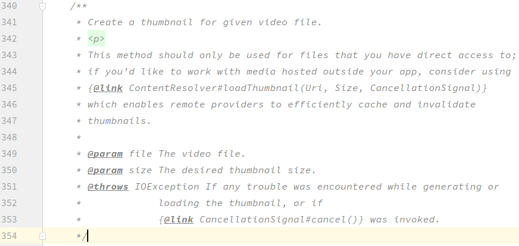

2. 方法代码如下，不难看出，该方法实质也是调用MMR实现，且传入时间参数为视频时长/2

   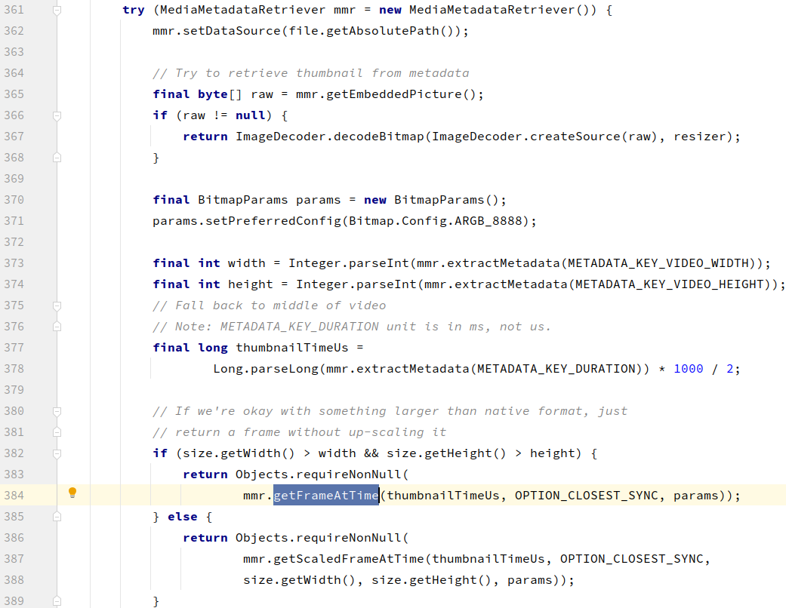

3. 该方法中会直接尝试使用getEmbeddedPicture()获取metadata中的图片(关联mediaFrameworkUnitTest)

   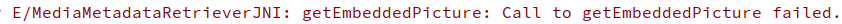

## 4.MediaMetadataRetriever.getFrameAtTime

1. 查看该类中方法可发现最终均调用native方法: _getFrameAtTime

   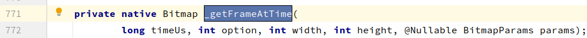

2. 进一步调用在: android_media_MediaMetadataRetriever.cpp  +366

   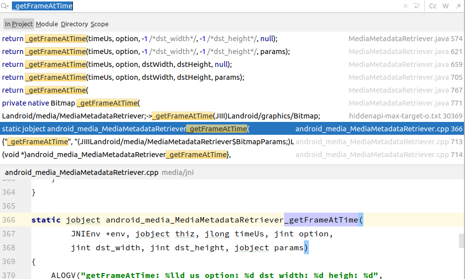
   
3. 主要通过如下4步获取到图片，我们主要关注的应该是第3步骤

   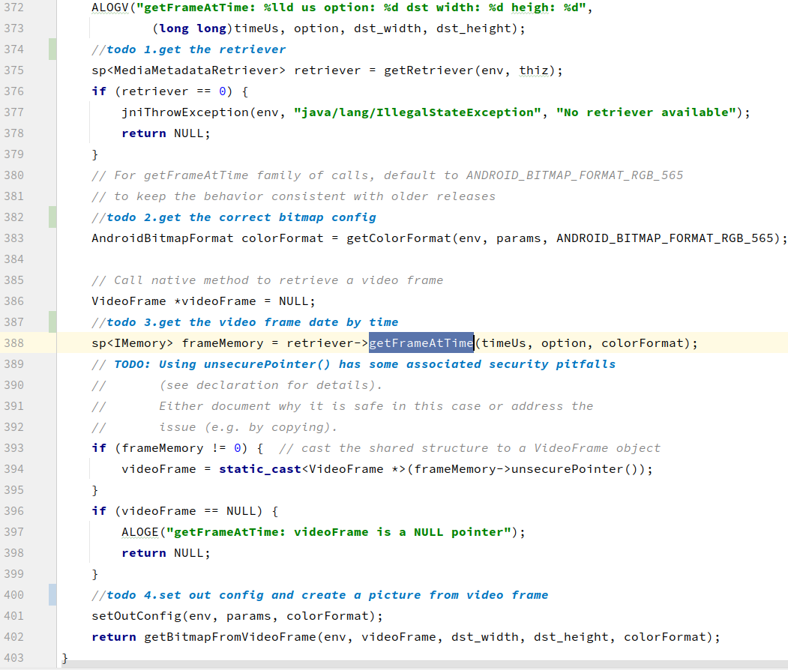

4. 继续查看代码会跟踪到av仓中mediametadataretriever.h +98,从定义中也可以看到colorFormat默认值,同时默认metaOnly值为false

   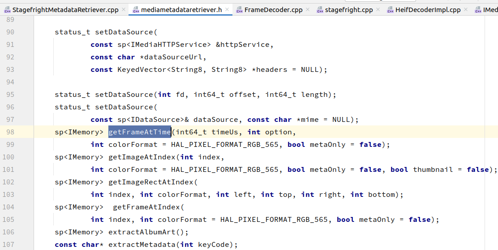

5. 查看mediametadataretriever.cpp +144,可以看到这里只是透传了一下

   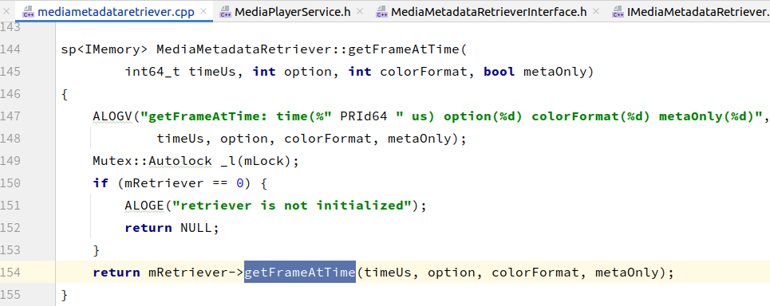

6. 打开LOG_TAG,简单查看日志

   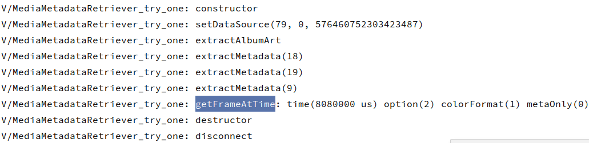

   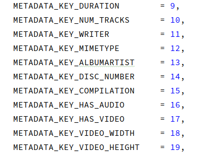

7. 继续搜索getFraameAtTime方法的定义，共有如下5个，第2个为之前看过的

   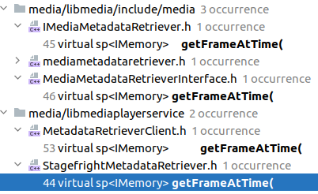

8. 其他4个定义部分关系如下

### 0.其他

1. [jni调用](https://blog.csdn.net/richu123/article/details/51722672)
2. [官网JNI](https://developer.android.com/training/articles/perf-jni)
3. [UML 类图](https://www.bilibili.com/video/BV1P741127u7?from=search&seid=12167969793587868693&spm_id_from=333.337.0.0)

### -1.问题

1. 若视频I帧很少，中间时间是否会花屏
2. 耗时问题，是否视频越长耗时越长

run cts-dev -m CtsMediaStressTestCases -t android.mediastress.cts.Vp8R480x360LongPlayerTest#testPlay00

adb shell am instrument -e class android.mediastress.cts.Vp8R480x360LongPlayerTest#testPlay00 -w android.mediastress.cts/androidx.test.runner.AndroidJUnitRunner

run cts-dev -m CtsMediaTestCases -t android.media.cts.MediaSessionTest#testSetQueueWithLargeNumberOfItems

adb shell am instrument -e class android.media.cts.MediaSessionTest#testSetQueueWithLargeNumberOfItems -w android.media.cts/androidx.test.runner.AndroidJUnitRunner
