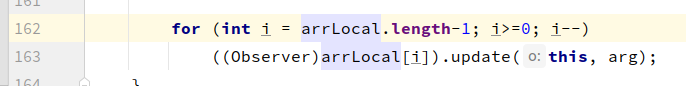

# 观察者模式
- 定义了对象之间的一对多依赖，这样一来，当以的对象改变状态时，他的所有依赖者都会收到通知并自动更新

# 设计原则
- 为了交互对象之间的松耦合设计而努力

# subject--observer
- subject: 统一发送所有消息
- observer: 希望可以按需获取

# java内置
- 如果是自己实现的，那么每次构建对象时添加至观察者列表，通知遍历时与添加顺序相关
- 如果是使用java内置实现的，那么通知时，未必按照添加顺序进行通知，具体通知顺序与Observable.java实现有关
> 目前实现(sdk-32), observer对象使用vector保存，通知时倒序通知，内部使用大量同步方法
> 