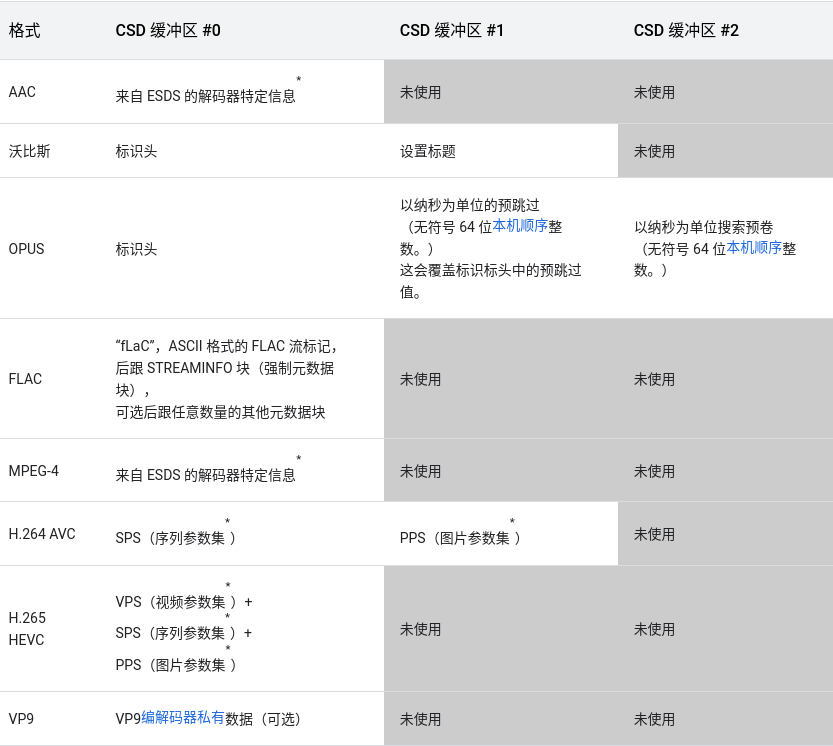

## videoCodec 杂七杂八


#### About fLaC question

1. [from google](https://developer.android.com/reference/android/media/MediaCodec)

   


#### About blocks-per-second

1. is mean how many blocks can be deal with a second


#### MediaCodecInfo.java

- resolution description
  480p 576p 被称为度SD(Standard Definition)（标清）
  

720p 被称为HD(High Definition)（高清）

1080p 被称为FHD(Full High Definition)（全高清）

4k 被称为UHD(Ultra High Definition)(超高答清)(或 4k UHD)

8k 被称为FUHD(Full Ultra High Definition)(8k超高清)(或 8k UHD)

- SD--->
/** 480p 24fps */
public static final PerformancePoint SD_24 = new PerformancePoint(720, 480, 24);
/** 576p 25fps */
public static final PerformancePoint SD_25 = new PerformancePoint(720, 576, 25);
/** 480p 30fps */
public static final PerformancePoint SD_30 = new PerformancePoint(720, 480, 30);
/** 480p 48fps */
public static final PerformancePoint SD_48 = new PerformancePoint(720, 480, 48);
/** 576p 50fps */
public static final PerformancePoint SD_50 = new PerformancePoint(720, 576, 50);
/** 480p 60fps */
public static final PerformancePoint SD_60 = new PerformancePoint(720, 480, 60);

- HD--->
/** 720p 24fps */
public static final PerformancePoint HD_24 = new PerformancePoint(1280, 720, 24);
/** 720p 25fps */
public static final PerformancePoint HD_25 = new PerformancePoint(1280, 720, 25);
/** 720p 30fps */
public static final PerformancePoint HD_30 = new PerformancePoint(1280, 720, 30);
/** 720p 50fps */
public static final PerformancePoint HD_50 = new PerformancePoint(1280, 720, 50);
/** 720p 60fps */
public static final PerformancePoint HD_60 = new PerformancePoint(1280, 720, 60);
/** 720p 100fps */
public static final PerformancePoint HD_100 = new PerformancePoint(1280, 720, 100);
/** 720p 120fps */
public static final PerformancePoint HD_120 = new PerformancePoint(1280, 720, 120);
/** 720p 200fps */
public static final PerformancePoint HD_200 = new PerformancePoint(1280, 720, 200);
/** 720p 240fps */
public static final PerformancePoint HD_240 = new PerformancePoint(1280, 720, 240);

- FHD--->
  /** 1080p 24fps */
  public static final PerformancePoint FHD_24 = new PerformancePoint(1920, 1080, 24);
  /** 1080p 25fps */
  public static final PerformancePoint FHD_25 = new PerformancePoint(1920, 1080, 25);
  /** 1080p 30fps */
  public static final PerformancePoint FHD_30 = new PerformancePoint(1920, 1080, 30);
  /** 1080p 50fps */
  public static final PerformancePoint FHD_50 = new PerformancePoint(1920, 1080, 50);
  /** 1080p 60fps */
  public static final PerformancePoint FHD_60 = new PerformancePoint(1920, 1080, 60);
  /** 1080p 100fps */
  public static final PerformancePoint FHD_100 = new PerformancePoint(1920, 1080, 100);
  /** 1080p 120fps */
  public static final PerformancePoint FHD_120 = new PerformancePoint(1920, 1080, 120);
  /** 1080p 200fps */
  public static final PerformancePoint FHD_200 = new PerformancePoint(1920, 1080, 200);
  /** 1080p 240fps */
  public static final PerformancePoint FHD_240 = new PerformancePoint(1920, 1080, 240);
  
- UHD--->         
/** 2160p 24fps */
public static final PerformancePoint UHD_24 = new PerformancePoint(3840, 2160, 24);
/** 2160p 25fps */
public static final PerformancePoint UHD_25 = new PerformancePoint(3840, 2160, 25);
/** 2160p 30fps */
public static final PerformancePoint UHD_30 = new PerformancePoint(3840, 2160, 30);
/** 2160p 50fps */
public static final PerformancePoint UHD_50 = new PerformancePoint(3840, 2160, 50);
/** 2160p 60fps */
public static final PerformancePoint UHD_60 = new PerformancePoint(3840, 2160, 60);
/** 2160p 100fps */
public static final PerformancePoint UHD_100 = new PerformancePoint(3840, 2160, 100);
/** 2160p 120fps */
public static final PerformancePoint UHD_120 = new PerformancePoint(3840, 2160, 120);
/** 2160p 200fps */
public static final PerformancePoint UHD_200 = new PerformancePoint(3840, 2160, 200);
/** 2160p 240fps */
public static final PerformancePoint UHD_240 = new PerformancePoint(3840, 2160, 240);


mediaformatshaper library to amend MediaFormat parameters before encoding. This is the initial cut of the library. Disabled by default, enable with "setprop debug.stagefright.enableshaping 1" 

enableMediaFormatShapingProperty


```c
void CCodec::configure(const sp<AMessage> &msg)
```


```java
/*
 * Do not change these metadata key values without updating their
 * counterparts in include/media/mediametadataretriever.h!
 */
/**
 * The metadata key to retrieve the numeric string describing the
 * order of the audio data source on its original recording.
 */
public static final int METADATA_KEY_CD_TRACK_NUMBER = 0;
/**
 * The metadata key to retrieve the information about the album title
 * of the data source.
 */
public static final int METADATA_KEY_ALBUM           = 1;
/**
 * The metadata key to retrieve the information about the artist of
 * the data source.
 */
public static final int METADATA_KEY_ARTIST          = 2;
/**
 * The metadata key to retrieve the information about the author of
 * the data source.
 */
public static final int METADATA_KEY_AUTHOR          = 3;
/**
 * The metadata key to retrieve the information about the composer of
 * the data source.
 */
public static final int METADATA_KEY_COMPOSER        = 4;
/**
 * The metadata key to retrieve the date when the data source was created
 * or modified.
 */
public static final int METADATA_KEY_DATE            = 5;
/**
 * The metadata key to retrieve the content type or genre of the data
 * source.
 */
public static final int METADATA_KEY_GENRE           = 6;
/**
 * The metadata key to retrieve the data source title.
 */
public static final int METADATA_KEY_TITLE           = 7;
/**
 * The metadata key to retrieve the year when the data source was created
 * or modified.
 */
public static final int METADATA_KEY_YEAR            = 8;
/**
 * The metadata key to retrieve the playback duration (in ms) of the data source.
 */
public static final int METADATA_KEY_DURATION        = 9;
/**
 * The metadata key to retrieve the number of tracks, such as audio, video,
 * text, in the data source, such as a mp4 or 3gpp file.
 */
public static final int METADATA_KEY_NUM_TRACKS      = 10;
/**
 * The metadata key to retrieve the information of the writer (such as
 * lyricist) of the data source.
 */
public static final int METADATA_KEY_WRITER          = 11;
/**
 * The metadata key to retrieve the mime type of the data source. Some
 * example mime types include: "video/mp4", "audio/mp4", "audio/amr-wb",
 * etc.
 */
public static final int METADATA_KEY_MIMETYPE        = 12;
/**
 * The metadata key to retrieve the information about the performers or
 * artist associated with the data source.
 */
public static final int METADATA_KEY_ALBUMARTIST     = 13;
/**
 * The metadata key to retrieve the numberic string that describes which
 * part of a set the audio data source comes from.
 */
public static final int METADATA_KEY_DISC_NUMBER     = 14;
/**
 * The metadata key to retrieve the music album compilation status.
 */
public static final int METADATA_KEY_COMPILATION     = 15;
/**
 * If this key exists the media contains audio content.
 */
public static final int METADATA_KEY_HAS_AUDIO       = 16;
/**
 * If this key exists the media contains video content.
 */
public static final int METADATA_KEY_HAS_VIDEO       = 17;
/**
 * If the media contains video, this key retrieves its width.
 */
public static final int METADATA_KEY_VIDEO_WIDTH     = 18;
/**
 * If the media contains video, this key retrieves its height.
 */
public static final int METADATA_KEY_VIDEO_HEIGHT    = 19;
/**
 * This key retrieves the average bitrate (in bits/sec), if available.
 */
public static final int METADATA_KEY_BITRATE         = 20;
/**
 * This key retrieves the language code of text tracks, if available.
 * If multiple text tracks present, the return value will look like:
 * "eng:chi"
 * @hide
 */
public static final int METADATA_KEY_TIMED_TEXT_LANGUAGES      = 21;
/**
 * If this key exists the media is drm-protected.
 * @hide
 */
public static final int METADATA_KEY_IS_DRM          = 22;
/**
 * This key retrieves the location information, if available.
 * The location should be specified according to ISO-6709 standard, under
 * a mp4/3gp box "@xyz". Location with longitude of -90 degrees and latitude
 * of 180 degrees will be retrieved as "+180.0000-90.0000/", for instance.
 */
public static final int METADATA_KEY_LOCATION        = 23;
/**
 * This key retrieves the video rotation angle in degrees, if available.
 * The video rotation angle may be 0, 90, 180, or 270 degrees.
 */
public static final int METADATA_KEY_VIDEO_ROTATION = 24;
/**
 * This key retrieves the original capture framerate, if it's
 * available. The capture framerate will be a floating point
 * number.
 */
public static final int METADATA_KEY_CAPTURE_FRAMERATE = 25;
/**
 * If this key exists the media contains still image content.
 */
public static final int METADATA_KEY_HAS_IMAGE       = 26;
/**
 * If the media contains still images, this key retrieves the number
 * of still images.
 */
public static final int METADATA_KEY_IMAGE_COUNT     = 27;
/**
 * If the media contains still images, this key retrieves the image
 * index of the primary image.
 */
public static final int METADATA_KEY_IMAGE_PRIMARY   = 28;
/**
 * If the media contains still images, this key retrieves the width
 * of the primary image.
 */
public static final int METADATA_KEY_IMAGE_WIDTH     = 29;
/**
 * If the media contains still images, this key retrieves the height
 * of the primary image.
 */
public static final int METADATA_KEY_IMAGE_HEIGHT    = 30;
/**
 * If the media contains still images, this key retrieves the rotation
 * angle (in degrees clockwise) of the primary image. The image rotation
 * angle must be one of 0, 90, 180, or 270 degrees.
 */
public static final int METADATA_KEY_IMAGE_ROTATION  = 31;
/**
 * If the media contains video and this key exists, it retrieves the
 * total number of frames in the video sequence.
 */
public static final int METADATA_KEY_VIDEO_FRAME_COUNT = 32;

/**
 * If the media contains EXIF data, this key retrieves the offset (in bytes)
 * of the data.
 */
public static final int METADATA_KEY_EXIF_OFFSET = 33;

/**
 * If the media contains EXIF data, this key retrieves the length (in bytes)
 * of the data.
 */
public static final int METADATA_KEY_EXIF_LENGTH = 34;

/**
 * This key retrieves the color standard, if available.
 *
 * @see MediaFormat#COLOR_STANDARD_BT709
 * @see MediaFormat#COLOR_STANDARD_BT601_PAL
 * @see MediaFormat#COLOR_STANDARD_BT601_NTSC
 * @see MediaFormat#COLOR_STANDARD_BT2020
 */
public static final int METADATA_KEY_COLOR_STANDARD = 35;

/**
 * This key retrieves the color transfer, if available.
 *
 * @see MediaFormat#COLOR_TRANSFER_LINEAR
 * @see MediaFormat#COLOR_TRANSFER_SDR_VIDEO
 * @see MediaFormat#COLOR_TRANSFER_ST2084
 * @see MediaFormat#COLOR_TRANSFER_HLG
 */
public static final int METADATA_KEY_COLOR_TRANSFER = 36;

/**
 * This key retrieves the color range, if available.
 *
 * @see MediaFormat#COLOR_RANGE_LIMITED
 * @see MediaFormat#COLOR_RANGE_FULL
 */
public static final int METADATA_KEY_COLOR_RANGE    = 37;

/**
 * This key retrieves the sample rate in Hz, if available.
 * This is a signed 32-bit integer formatted as a string in base 10.
 */
public static final int METADATA_KEY_SAMPLERATE      = 38;

/**
 * This key retrieves the bits per sample in numbers of bits, if available.
 * This is a signed 32-bit integer formatted as a string in base 10.
 */
public static final int METADATA_KEY_BITS_PER_SAMPLE = 39;

/**
 * This key retrieves the video codec mimetype if available.
 * @hide
 */
@SystemApi(client = MODULE_LIBRARIES)
public static final int METADATA_KEY_VIDEO_CODEC_MIME_TYPE = 40;

/**
 * If the media contains XMP data, this key retrieves the offset (in bytes)
 * of the data.
 */
public static final int METADATA_KEY_XMP_OFFSET = 41;

/**
 * If the media contains XMP data, this key retrieves the length (in bytes)
 * of the data.
 */
public static final int METADATA_KEY_XMP_LENGTH = 42;
```
