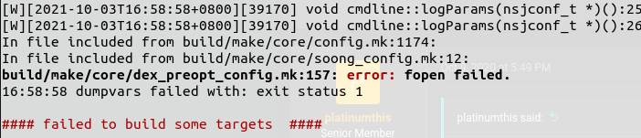
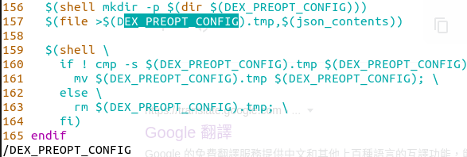
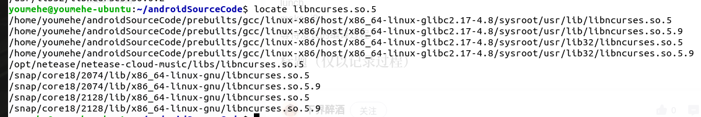
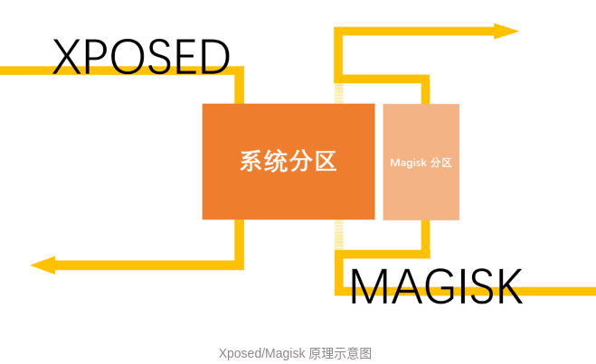
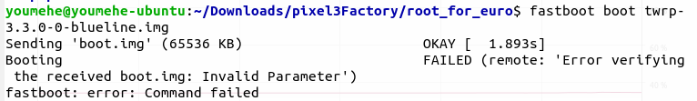
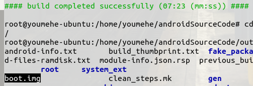
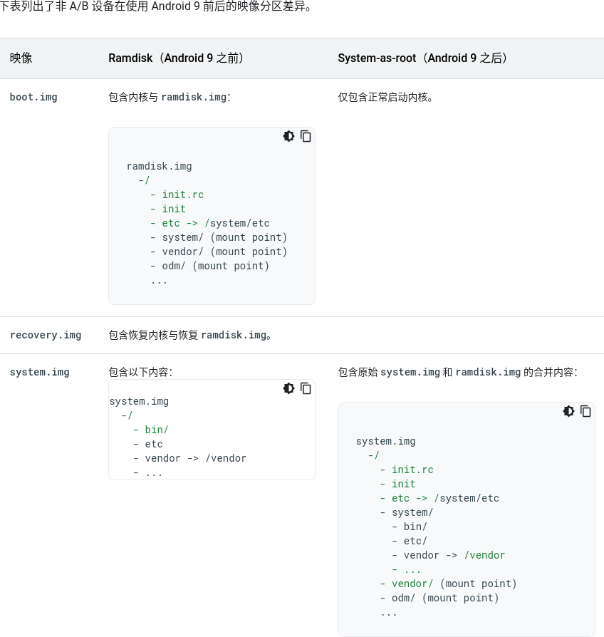

#### Android版本及代号

| 手机        | 代号                 | Cpu      | gpu        |      |
| :---------- | :------------------- | :------- | ---------- | ---- |
| Pixel       | sailfish(旗鱼)       | 高通821  | Adreno 530 |      |
| PixelXL     | marlin(马林鱼)       |          |            |      |
| Pixel2      | walleye(角膜白斑)    | 高通835  | Adreno 540 |      |
| Pixel2XL    | taimen(太门)         |          |            |      |
| Pixel3      | blueline(蓝线)       | 高通845  | Adreno 630 |      |
| Pixel3XL    | crosshatch(交叉影线) |          |            |      |
| Pixel3a     | sargo(萨戈)          | 高通670  | Adreno 615 |      |
| Pixel3aXL   | bonito(鲣)           |          |            |      |
| Pixel4      | flame(火焰)          | 高通855  | Adreno 640 |      |
| Pixel4XL    | coral(珊瑚)          |          |            |      |
| Pixel4a     | sunfish(翻车鱼)      | 高通730G | Adreno 618 |      |
| Pixel4a(5G) | bramble(荆棘)        | 高通765G | Adreno 620 |      |
| Pixel5      | redfin(红鳍)         | 高通765G | Adreno 620 |      |
| Pixel6      | barbet(巴贝特)       | 谷歌G1   |            |      |
|             |                      |          |            |      |

#### 优化编译条件(设置ccache)

1. why
   1. 经常使用make clean
   2. 经常在不同的编译产品之间切换
   3. 增量编译可能会慢
   4. [ccache 文档](https://ccache.dev/documentation.html)
2. how
   1. https://source.android.com/source/initializing#optimizing-a-build-environment
   2. https://blog.csdn.net/qq_34787560/article/details/89467776
3. actual
   1. 由于兼容及效率提升问题，谷歌已不再内置ccache，详见androidSourceCode/build/make/core/ccache.mk
   2. 需要添加 ccache 可执行的 CCACHE_EXEC 环境变量export CCACHE_EXEC=/usr/bin/

#### 构建整机Rom前需要下载驱动

1. [根据构建版本号获取对应专有文件](https://source.android.com/setup/build/downloading#obtaining-proprietary-binaries)

   

#### 开始编译

1. source build/envsetup.sh

2. lunch 4(for test device pixel3)

3. make libstagefright -j8

   1. wrong  like this 

   2. 打开报错位置查看报错原因

      

   3. 搜索后路径为: out/soong/，该文件存在，使用chmod -r 777调整代码权限后解决

   4. 再次编译出现新的报错:  out/soong/host/linux-x86/bin/llvm-rs-cc: error while loading shared libraries: libncurses.so.5

   5. 查看该so存在

   6. 搜索后确定为ubuntu系统缺失该文件导致，安装后继续编译:  [sudo apt-get install libncurses5](https://blog.csdn.net/druieam/article/details/106818875)

   7. 编译成功

#### 手机Root

1. 当前状态: magisk 22.1，简单了解[magisk与xpsd区别](https://sspai.com/post/53043/)
2. 总之就是需要再次刷root，[谷歌刷机](https://www.jianshu.com/p/1f4a2b18246a)完成后依旧没有root权限
3. [twrp刷root](https://twrp.me/google/googlepixel3.html)，存在报错为
4. [xda推荐使用magsik](https://www.xda-developers.com/google-pixel-3-unlock-bootloader-root-magisk/)
5. [magisk install](https://topjohnwu.github.io/Magisk/install.html#patching-images)
6. 使用官方方法在adb shell后可以获取root，但是adb remount失败，私有目录无写权限
7. 目前来看还是R版本之后问题，尝试从官网下载Q版本代码刷入twrp，报错有变化，最后还是失败了，问了一圈，说是目前只能达到adb shell后su获去root，挂载vendor、system暂无方案
8. 其实核心就是boot.img嘛，只要找到控制root的地方，编译出boot.img后刷入应该就okay了
9. [Mounting system as R/W is impossible on stock software (OOS, OneUI etc).
   This applies to all devices launched with Android 10, so, 7T/Pro and up.](https://forum.xda-developers.com/t/there-is-a-magisk-module-to-mount-r-w.4187797/)
10. [find a solution fro XDA](https://forum.xda-developers.com/t/script-android-10-universal-mount-system-read-write-r-w.4247311/page-56)
11. [A/B更新](https://source.android.com/devices/tech/ota/ab#slots)
    1. [boot_control.h](https://android.googlesource.com/platform/hardware/libhardware/+/master/include/hardware/boot_control.h)中定义了控制A、B槽点的相关接口
    2. [update_engine](https://android.googlesource.com/platform/system/update_engine/)进程为更新时的守护进程
12. [system-as-root](https://source.android.google.cn/devices/bootloader/partitions/system-as-root?hl=zh-cn)
13. [刷写设备](https://source.android.com/setup/build/running)

#### 执行Cts测试

1. atest android.media.cts.MediaPlayerTest#testMediaTimeDiscontinuity  -- --module-arg  CtsMediaTestCases:local-media-path:/tmp/android-cts-media-1.5
2. 首先爆出缺少libncurse.so.5，
3. [TF自动化测试框架](https://source.android.google.cn/devices/tech/test_infra/tradefed?hl=zh-cn)(性能部分需要关注)

#### IEMI查询

1. https://ericclose.github.io/Pixel-repairs-and-carriers.html
2. https://store.google.com/us/repair
3. https://www.imeipro.info/
4. https://www.imei.info/