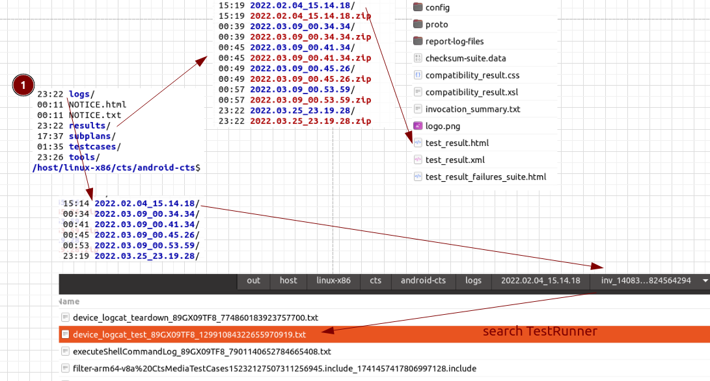
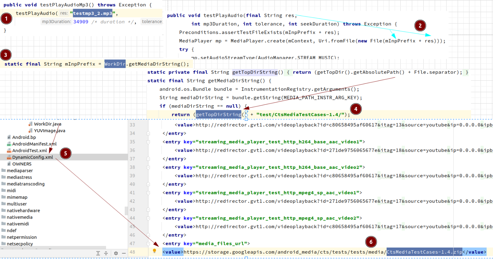
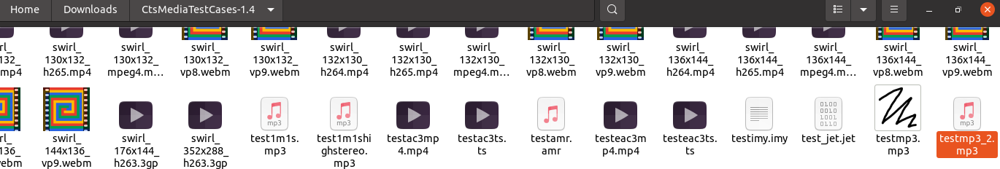
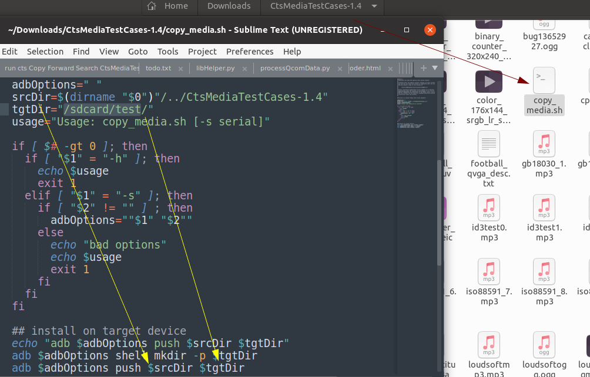
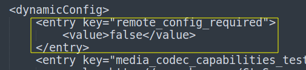
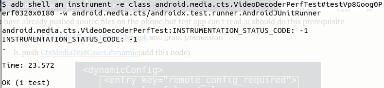
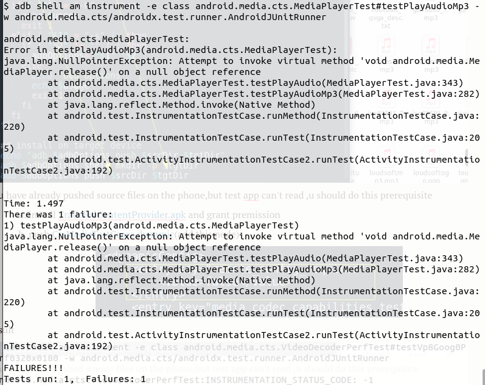
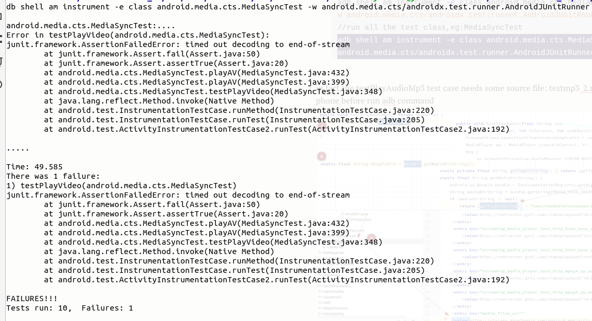

# Running CTS tests

## 1. how to get test suite

1. download from [Google](https://source.android.com/compatibility/cts/downloads)
2. download source code from [Google then make cts](https://github.com/CatLittleLazy/videoCodec/blob/main/android.md)
2. the source code in [cts](https://cs.android.com/android/platform/superproject/+/master:cts/)

## 2. [run with test environment](https://source.android.com/compatibility/cts/run)

0. This way is good for testing all modules or checking if some changes will generate errors

1. enter test environment

   ```sh
   ./android-cts/tools/cts-tradefed
   ```

2. Common test commands
   
   ```sh
   //run all
   run cts
   //run one module,eg: CtsMediaTestCases
   run cts -m CtsMediaTestCases
   //run more than one modules,eg: CtsMediaTestCases,CtsMediaVideoTestCases
   run cts --include-filter "CtsMediaTestCases" --include-filter "CtsVideoTestCases"
   //run one cases,eg: testAvcGoog0Perf0320x0240
   run cts -m CtsVideoTestCases -t android.video.cts.VideoEncoderDecoderTest#testAvcGoog0Perf0320x0240
   //run more than one test cases,eg:testAvcGoog0Perf0320x0240,testPlayAudioMp3
   run cts --include-filter "CtsVideoTestCases android.video.cts.VideoEncoderDecoderTest#testAvcGoog0Perf0320x0240" --include-filte "CtsMediaTestCases android.media.cts.testPlayAudioMp3#testPlayAudioMp3"
   //run without check
   run cts-dev .....
   //run with one abi
   run xxxxxxxxxx --abi arm64v8
   ```
   
3. [result and log](https://source.android.com/compatibility/cts/interpret)

   

   

## 3. run with adb commands

0. This way is suitable for analyzing cts failure test cases

1. install the test Module apk at first, eg: CtsMediaTestCases

   ```sh
   //u will find this apk file in android-cts/testcases/ dir
   adb install CtsMediaTestCases.apk
   //grant permissions,eg. CAMERA
   adb shell pm grant android.media.cts android.permission.CAMERA
   //run test,eg testPlayAudioMp3
   adb shell am instrument -e class android.media.cts.MediaPlayerTest#testPlayAudioMp3 -w android.media.cts/androidx.test.runner.AndroidJUnitRunner
   //run all the test class,eg:MediaSyncTest
   adb shell am instrument -e class android.media.cts.MediaSyncTest -w android.media.cts/androidx.test.runner.AndroidJUnitRunner
   ```

2. in fact,the testPlayAudioMp3 test case needs some source file: testmp3_2.mp3, so we should push this file to phone before run adb command

   

3. we can just push this file to phone,or run copy_media.sh to push all files to phone

   

   

4. if u have already pushed source files on the phone,but test app can't read ,u should do this prerequisite

   1. install [TradefedContentProvider.apk](https://github.com/CatLittleLazy/videoCodec/tree/main/cts/CtsMediaTestCases) and grant premission

   2. push [CtsMediaTestCases.dynamic](https://github.com/CatLittleLazy/videoCodec/blob/main/cts/CtsMediaTestCases/CtsMediaTestCases.dynamic)(add this node)

      
   
5. result

   

   

   

6. log

   ```
   //you should get the applog when you are testing by this command 
   adb logcat -c & adb logcat > testLog.txt
   ```

   