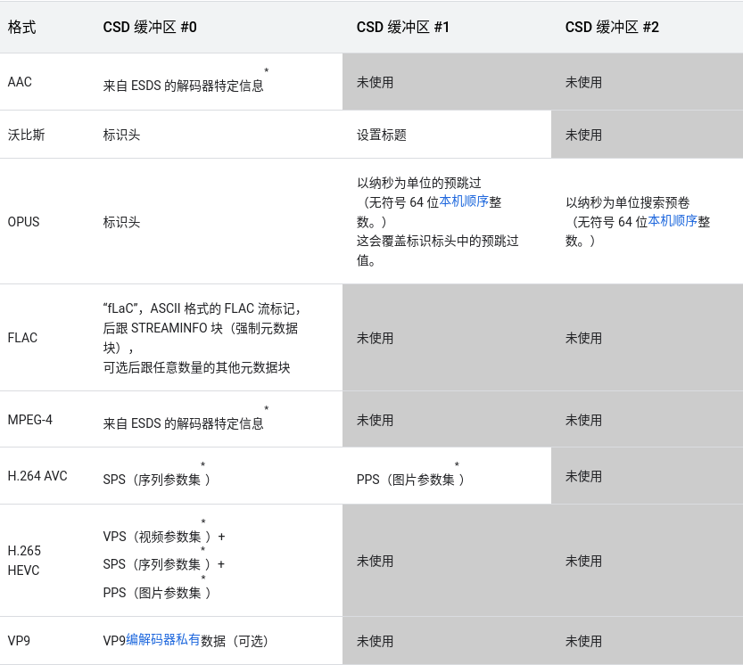

## videoCodec 杂七杂八

#### About fLaC question

1. [from google](https://developer.android.com/reference/android/media/MediaCodec)

   

#### About blocks-per-second

1. is mean how many blocks can be deal with a second

#### MediaCodecInfo.java

- resolution description
  480p 576p 被称为度SD(Standard Definition)（标清）
  

720p 被称为HD(High Definition)（高清）

1080p 被称为FHD(Full High Definition)（全高清）

4k 被称为UHD(Ultra High Definition)(超高答清)(或 4k UHD)

8k 被称为FUHD(Full Ultra High Definition)(8k超高清)(或 8k UHD)

- SD--->
/** 480p 24fps */
public static final PerformancePoint SD_24 = new PerformancePoint(720, 480, 24);
/** 576p 25fps */
public static final PerformancePoint SD_25 = new PerformancePoint(720, 576, 25);
/** 480p 30fps */
public static final PerformancePoint SD_30 = new PerformancePoint(720, 480, 30);
/** 480p 48fps */
public static final PerformancePoint SD_48 = new PerformancePoint(720, 480, 48);
/** 576p 50fps */
public static final PerformancePoint SD_50 = new PerformancePoint(720, 576, 50);
/** 480p 60fps */
public static final PerformancePoint SD_60 = new PerformancePoint(720, 480, 60);

- HD--->
/** 720p 24fps */
public static final PerformancePoint HD_24 = new PerformancePoint(1280, 720, 24);
/** 720p 25fps */
public static final PerformancePoint HD_25 = new PerformancePoint(1280, 720, 25);
/** 720p 30fps */
public static final PerformancePoint HD_30 = new PerformancePoint(1280, 720, 30);
/** 720p 50fps */
public static final PerformancePoint HD_50 = new PerformancePoint(1280, 720, 50);
/** 720p 60fps */
public static final PerformancePoint HD_60 = new PerformancePoint(1280, 720, 60);
/** 720p 100fps */
public static final PerformancePoint HD_100 = new PerformancePoint(1280, 720, 100);
/** 720p 120fps */
public static final PerformancePoint HD_120 = new PerformancePoint(1280, 720, 120);
/** 720p 200fps */
public static final PerformancePoint HD_200 = new PerformancePoint(1280, 720, 200);
/** 720p 240fps */
public static final PerformancePoint HD_240 = new PerformancePoint(1280, 720, 240);

- FHD--->
  /** 1080p 24fps */
  public static final PerformancePoint FHD_24 = new PerformancePoint(1920, 1080, 24);
  /** 1080p 25fps */
  public static final PerformancePoint FHD_25 = new PerformancePoint(1920, 1080, 25);
  /** 1080p 30fps */
  public static final PerformancePoint FHD_30 = new PerformancePoint(1920, 1080, 30);
  /** 1080p 50fps */
  public static final PerformancePoint FHD_50 = new PerformancePoint(1920, 1080, 50);
  /** 1080p 60fps */
  public static final PerformancePoint FHD_60 = new PerformancePoint(1920, 1080, 60);
  /** 1080p 100fps */
  public static final PerformancePoint FHD_100 = new PerformancePoint(1920, 1080, 100);
  /** 1080p 120fps */
  public static final PerformancePoint FHD_120 = new PerformancePoint(1920, 1080, 120);
  /** 1080p 200fps */
  public static final PerformancePoint FHD_200 = new PerformancePoint(1920, 1080, 200);
  /** 1080p 240fps */
  public static final PerformancePoint FHD_240 = new PerformancePoint(1920, 1080, 240);
  
- UHD--->         
/** 2160p 24fps */
public static final PerformancePoint UHD_24 = new PerformancePoint(3840, 2160, 24);
/** 2160p 25fps */
public static final PerformancePoint UHD_25 = new PerformancePoint(3840, 2160, 25);
/** 2160p 30fps */
public static final PerformancePoint UHD_30 = new PerformancePoint(3840, 2160, 30);
/** 2160p 50fps */
public static final PerformancePoint UHD_50 = new PerformancePoint(3840, 2160, 50);
/** 2160p 60fps */
public static final PerformancePoint UHD_60 = new PerformancePoint(3840, 2160, 60);
/** 2160p 100fps */
public static final PerformancePoint UHD_100 = new PerformancePoint(3840, 2160, 100);
/** 2160p 120fps */
public static final PerformancePoint UHD_120 = new PerformancePoint(3840, 2160, 120);
/** 2160p 200fps */
public static final PerformancePoint UHD_200 = new PerformancePoint(3840, 2160, 200);
/** 2160p 240fps */
public static final PerformancePoint UHD_240 = new PerformancePoint(3840, 2160, 240);
