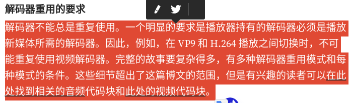
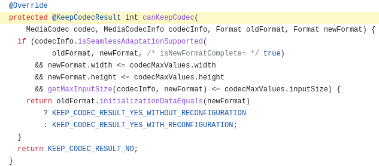
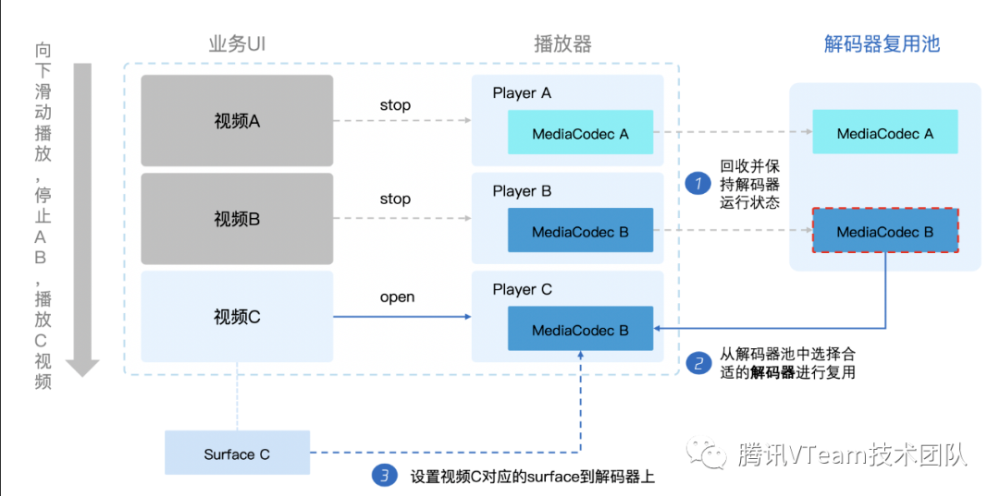
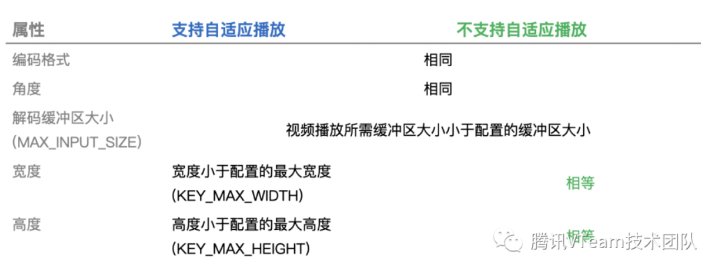
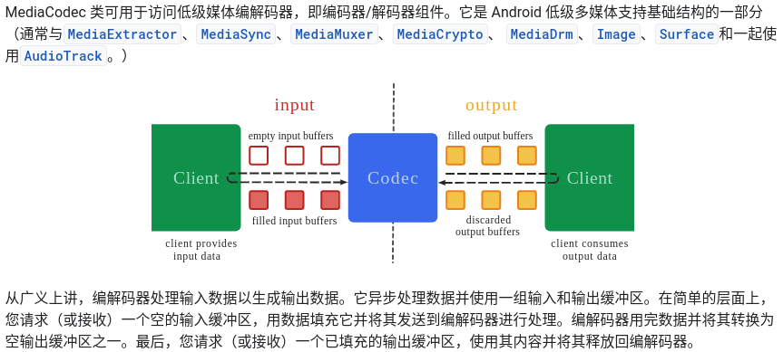
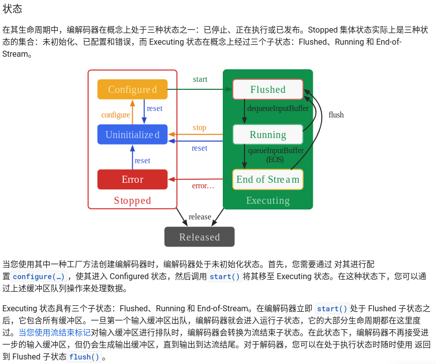
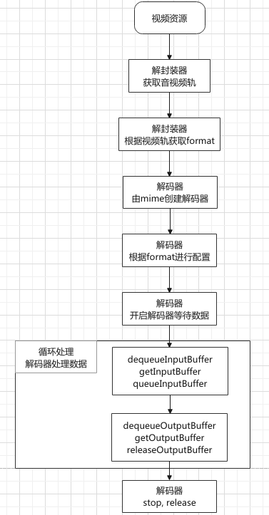

# Codec Reuse In Android

## 解码器复用示例

1. [改进了 ExoPlayer 中的解码器重用](https://medium.com/google-exoplayer/improved-decoder-reuse-in-exoplayer-ef4c6d99591d)

   

   > note [视频代码块](https://github.com/google/ExoPlayer/blob/92a7bb534a706fe917308af48a4958c99b3bb754/library/core/src/main/java/com/google/android/exoplayer2/video/MediaCodecVideoRenderer.java#L502)
   >
   > 

2. [看点视频秒开优化：解码器复用优化方案篇](https://cloud.tencent.com/developer/article/1717107)

   1. 复用池位置

      

   2. 复用条件

      

      > note
      >
      > 由上表格可以看出，能不能复用除了机器本身是否支持自适应播放属性外，最主要受编码格式和分辨率以及MAXINPUTSIZE影响。
      >
      > **1. 编码格式**
      >
      > 为了兼顾各个业务的实际情况，比如看点常见编码格式是H264和H265，解码器池支持**自定义编码格式**和**解码器池大小**，这里默认是优先保留一个H264和一个H265两个解码器，以便复用时提高复用率。当然业务也可以根据实际情况进行设置。
      >
      > **2. MAXINPUTSIZE**
      >
      > 自适应播放虽然可以适应不同分辨率的解码，但是受最大分辨率(MAXWIDTH\MAXHEIGHT)以及MAXINPUTSIZE限制，这里只需要确定了最大解码的分辨率，MAXINPUTSIZE可以推导得出。所以我们也暴露了业务支持最大分辨率的接口，在MediaCodec.configure()时，根据最大分辨率设置MAXWIDTH\MAXHEIGHT\MAXINPUTSIZE相关信息，保证所有视频复用解码器时不受**分辨率**影响。

## 解码器复用

1. [媒体编解码器](https://developer.android.com/reference/android/media/MediaCodec)

   

   

2. 正常解码流程(参考官方demo)

   

3. 

4. 

## 

