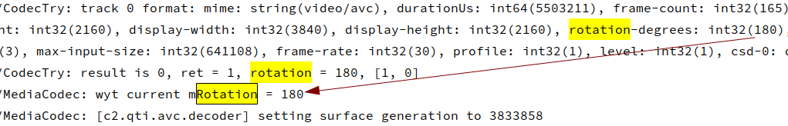

# Codec Reuse In Android

## 解码器复用示例

1. [改进了 ExoPlayer 中的解码器重用](https://medium.com/google-exoplayer/improved-decoder-reuse-in-exoplayer-ef4c6d99591d)

   

   > note [视频代码块](https://github.com/google/ExoPlayer/blob/92a7bb534a706fe917308af48a4958c99b3bb754/library/core/src/main/java/com/google/android/exoplayer2/video/MediaCodecVideoRenderer.java#L502)
   >
   > 

2. [看点视频秒开优化：解码器复用优化方案篇](https://cloud.tencent.com/developer/article/1717107)

   1. 复用池位置

      

   2. 复用条件

      

      > note
      >
      > 由上表格可以看出，能不能复用除了机器本身是否支持自适应播放属性外，最主要受编码格式和分辨率以及MAXINPUTSIZE影响。
      >
      > **1. 编码格式**
      >
      > 为了兼顾各个业务的实际情况，比如看点常见编码格式是H264和H265，解码器池支持**自定义编码格式**和**解码器池大小**，这里默认是优先保留一个H264和一个H265两个解码器，以便复用时提高复用率。当然业务也可以根据实际情况进行设置。
      >
      > **2. MAXINPUTSIZE**
      >
      > 自适应播放虽然可以适应不同分辨率的解码，但是受最大分辨率(MAXWIDTH\MAXHEIGHT)以及MAXINPUTSIZE限制，这里只需要确定了最大解码的分辨率，MAXINPUTSIZE可以推导得出。所以我们也暴露了业务支持最大分辨率的接口，在MediaCodec.configure()时，根据最大分辨率设置MAXWIDTH\MAXHEIGHT\MAXINPUTSIZE相关信息，保证所有视频复用解码器时不受**分辨率**影响。

## 解码器复用

1. [媒体编解码器](https://developer.android.com/reference/android/media/MediaCodec)

   

   

2. 正常解码流程(参考官方demo)

   

3. 

4. 

## 为何角度信息会有问题

复用解码codec时，即使每次都codec都走configure，[0°]-->[90°，180°，270°]成功-->[0°]失败

1. 问题现象：

   1. 首先播放0°视频

      

      

      

   2. 播放一个带角度的视频，如[180°]

      

      

      

   3. 最后，再次播放开头没有角度的视频

      

      

      

2. 问题根因：

   1. 没有旋转角的视频在format中没有【rotation】信息，在【MediaCodec】中，mRotationDegrees默认值为0，而在该场景下，【MediaCodec.configure】方法通过【format->findInt32】获取角度时，会返回fales，此时会设置为0°

      

      

   2. 同理，若视频设置了角度，那么此时返回值为true，不会进入置0逻辑

      

   3. 那么理论上来说第三次播放视频时同样会走置0逻辑，但是为什么还是会存在视频旋转的问题呢，进一步查看【MediaCodec】中的【mRotationDegrees】就会发现，该值用处其实不大

      

   4. 真正起作用的其实是当【MediaCodec.configure】时通过【Codec.configure】调用到【CCodecConfig.setParameters】，在【setParameters】方法中存在如下代码

      

   5. 问题场景流程如下：

      

   6. 由于第3次播放时，format中不存在rotation信息，根本走不到逻辑3，所以仍旧会使用上一次的format信息

   7. 为什么会使用上一次的信息呢，查看【CCodecConfig::updateFormats】不难看出，每次都会跟上一次的信息比较后更新

      

3. 解决方案(优选二)

   1. 【方案一】框架层修改，既然MediaCodec中存在format中检测不到旋转角度时设置mRotation为0°，那么是否可以考虑同时在format中是这角度为0°

      1. 【修改代码】
      2. 【优点】应用无感知
      3. 【缺点】影响点无法评估，需要提case咨询谷歌，同时还要关注cts测试结果

   2. 【方案二】应用层添加修改

      1. 【修改代码】

         

      2. 【优点】应用修改即可

      3. 【缺点】暂无

4. 方案验证

   1. 添加代码后查看日志如下：

      

      

   2. 录屏信息
   
      <video src="CodecReuse.assets/bugfix.mp4" sty></video>

