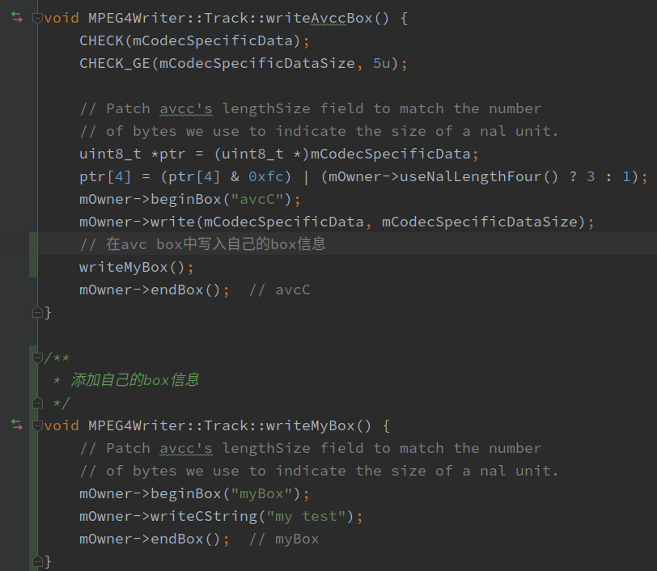
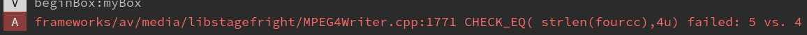
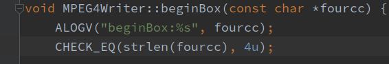

# MPEG4文件及box添加读取

---

### 1.MPGE4

### 2.mp4 文件 box结构

### 3.如何在Android中为mp4文件添加新的box

1. 在video track中添加box

   

2. 编译libstagefright.so替换后拍摄视频保存文件失败，查看日志，box名称只接受长度为4

   

   

3. 修改box名称：myBox --->  test后重新编译替换