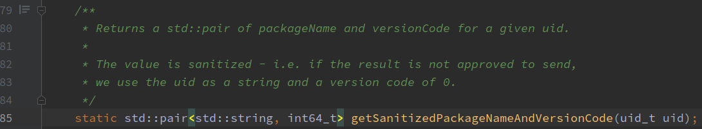
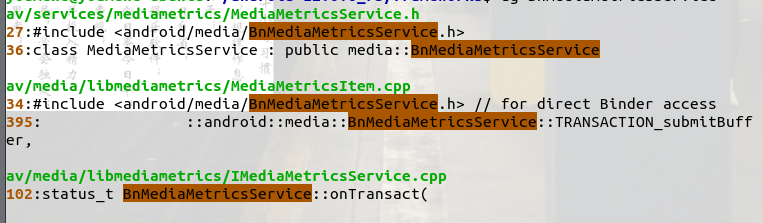
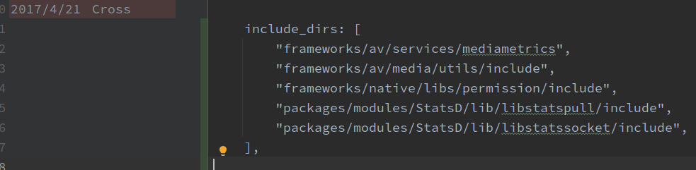

# Native层如何获取应用信息

---

## 1. native层获取应用信息的方法

- 获取应用上下文，通过反向调用到PackageManager的方法获取

- 通过MediaMetricsService中提供的静态方法getSanitizedPackageNameAndVersionCode获取

  

- 实际查看MediaMetrics提供的方法后，自然能够得出使用UidInfo提供的getInfo方法

  

## 2. MediaMetricsService&&UidInfo方法尝试

1. 在MediaCodec.cpp中添加头文件

   

2. 在MediaCodec目录下的Bp文件中找到“libstagefright”，在下方引入对应的头文件信息

   

3. 编译报错如下，可以看到，此时MediaCodec已经找到了头文件，但是头文件中引用的BnMediaMetricsService.h没有找到，我们在系统中找一下文件位置

   

4. 不难看出这个文件是过aidl时自动生成的

   

5. 我们接着找一下BnMediaMetricsService在哪里出现过

   

6. 可以看到主要是在libmediametrcis中，我们直接在该目录下的bp文件中找一下aidl-cpp

   

7. 将其添加到MediaCodec中的bp文件对应位置继续编译

   

8. 报错已更新

   

9. 按照报错找一下位置

   

10. 以此类推，失败的头文件引用全部添加后如下，编译通过

    

    

11. 实际添加代码后继续上报编译错误如下

    

12. 

---

## #. 其他

- 如何打印 int64_t

  https://blog.csdn.net/hejianhua1/article/details/80780188

- 