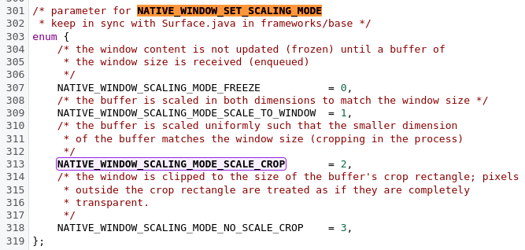

# setVideoScalingMode

---

1. api[描述](https://developer.android.com/reference/android/media/MediaPlayer#setVideoScalingMode(int)), 可以看到16就已经提供了，算是一个很古老的api了, btw, 这个是MediaPlayer的接口

   

2. api[描述](https://developer.android.com/reference/android/media/MediaCodec.html#setVideoScalingMode(int))，MediaCodec中也存在这个接口

   

3. 目前支持的模式对应值为，需要注意的是，该值仅在视频宽高相同时起作用

   

   

4. 从MediaPlayer到MediaCodec

5. MediaCodec中的方法实现，从经验来判断最终应该会作用到format信息中，就是configure方法中的那个format，不过surface上可能也需要作用到

   1. jni调用

      

      

      

   2. JMediaCodec主要还是持有1个MediaCodec对象

      

   3. JMediaCodec中的实现

      

   4. 这里存在2次下发，先给surfaceTextureClient端下发，再给format下发

      1. format下发部分

         1. 之前看解码器复用时rotation逻辑时简单了解了下这里的逻辑，确实是更新了format中的信息，添加了该字段，可以看到最终其实还是会作用到surface上

         2. 这里对应得是默认值为【VIDEO_SCALING_MODE_SCALE_TO_FIT】

            

      2. surfaceTextureClient下发部分

         1. 最终实在window上生效

            

         2. 实际上时支持4种的，未对外暴露的是0，3

            

         3. 

   5. 

6. 目前对该接口简单的了解了，那么我们在demo中进行调用(测试该值写入3，0可以，写入其他值会不显示最终crash)

   1. 设置为 VIDEO_SCALING_MODE_SCALE_TO_FIT 时 完全填充导致出现变形

      

      

      

   2. 设置为 VIDEO_SCALING_MODE_SCALE_TO_FIT_WITH_CROPPING 时裁剪不拉伸

      

      

      

      

      

