# Android video width

## 1、视频宽度api

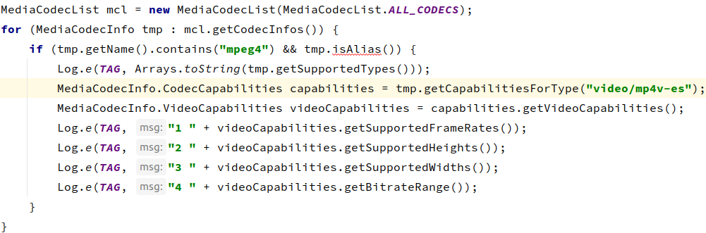

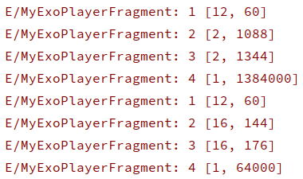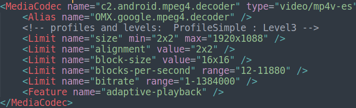

## 2、getSupportedWidths()方法返回有误

- 期望：【2--1920】
- 实际：【2--1344】

## 3、具体分析

1. ​	MediaCodecInfo的创建

   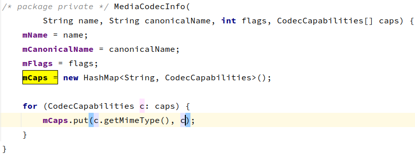

   - 未对外提供构造方法，包内访问
   - Codec的能力在初始化时根据支持类型(eg. video/mp4v-vs)写入hashMap中

2. CodeCapabilities的创建

   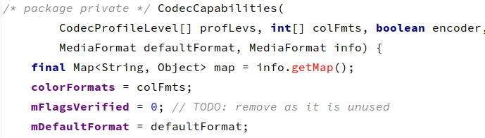

   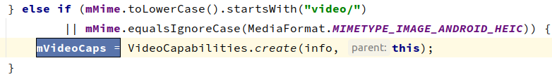

   - 同样未对外提供构造方法，包内访问
   - 若mimeType为video，则构造VideoCapabilities，传入info就是MediaFormat

3. VideoCapabilities的创建

   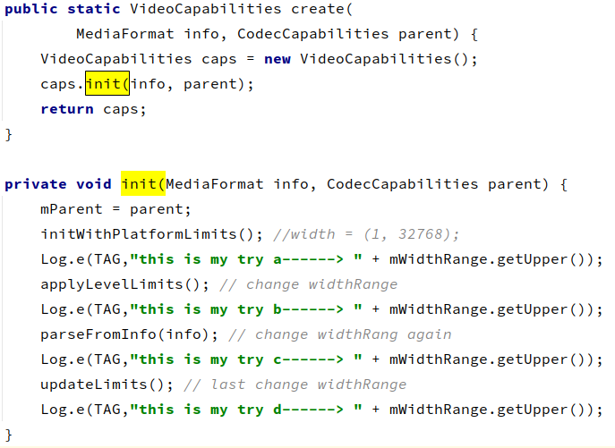

4. 添加完部分日志后进行编译：【make framework-minus-apex】

   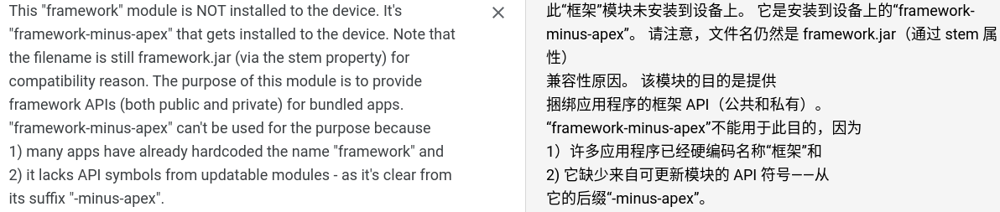
   
5. 直接push后手机无法开机，尝试替换services.jar后以及无法开，上报错误如下：

   Native registration unable to find class 'android/os/SystemClock'; aborting

6. [查询后得知](https://blog.csdn.net/superlee1125/article/details/115491698)需要同时删除system/framework目录下的【ota】【arm】【arm64】

   

7. 查看添加日志：

   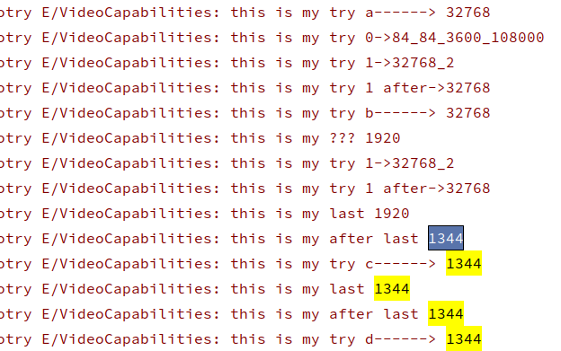

   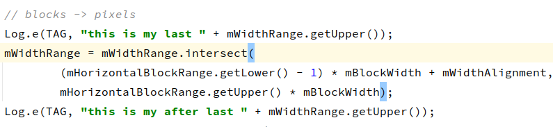

8. 简单看了下，这里进行取交集时，取出了最大值1344，也就是mHorizontalBlockRange.getUpper() * mBlockWidth = 1344，mBlockWidth应该是xml中的16，那么mHorizontalBlockRange.getUpper() = 84,很巧，日志第二行就打印过84出来

   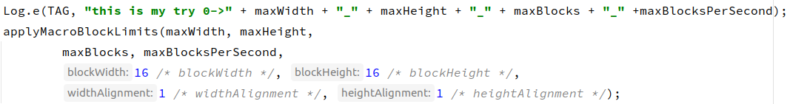

   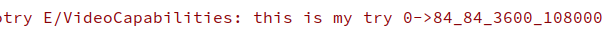

9. 继续简单查看代码添加日志：

   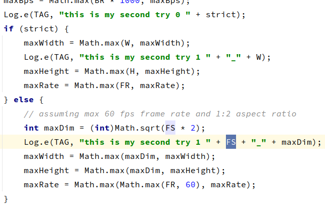

   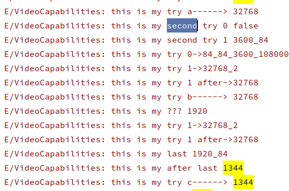

   

10. 可以看到这里的MPGE4在Level6时的FS为3600，查找FS[材料](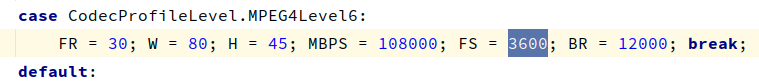)

   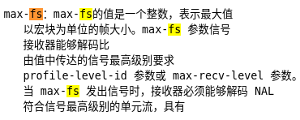

11. 暂未找到level6的fs设定值，通过倒推可以得出FS=7200时，maxDim = $$\sqrt{7200 * 2}$$  = 120,后续计算中，可得出maxWidth = 120 x 16 = 1920

    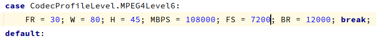

    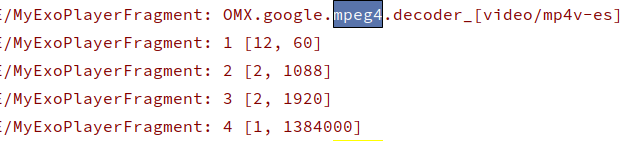

    