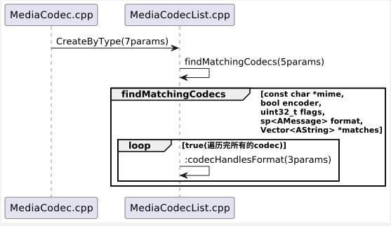
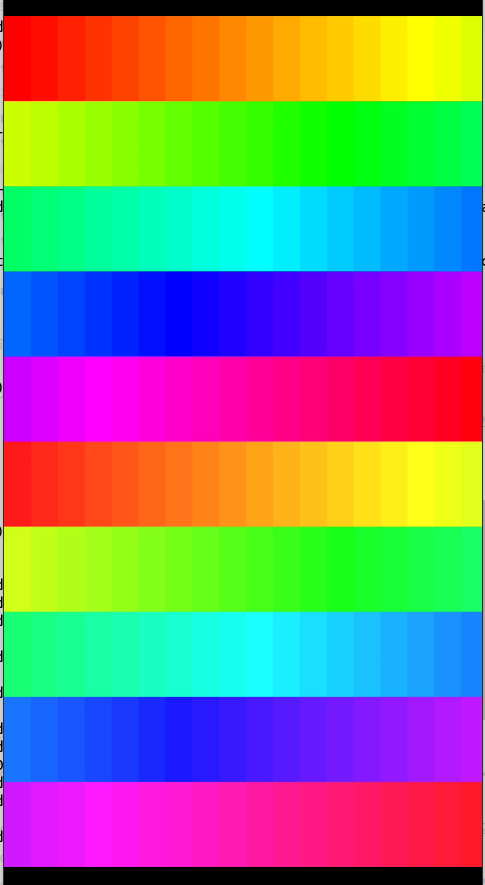

# Android video width

## 1、视频宽度api

## 2、getSupportedWidths()方法返回有误

- 期望：【2--1920】
- 实际：【2--1344】

## 3、具体分析

1. ​	MediaCodecInfo的创建

   

   - 未对外提供构造方法，包内访问
   - Codec的能力在初始化时根据支持类型(eg. video/mp4v-vs)写入hashMap中

2. CodeCapabilities的创建

   

   

   - 同样未对外提供构造方法，包内访问
   - 若mimeType为video，则构造VideoCapabilities，传入info就是MediaFormat

3. VideoCapabilities的创建

   

4. 添加完部分日志后进行编译：【make framework-minus-apex】

   
   
5. 直接push后手机无法开机，尝试替换services.jar后以及无法开，上报错误如下：

   Native registration unable to find class 'android/os/SystemClock'; aborting

6. [查询后得知](https://blog.csdn.net/superlee1125/article/details/115491698)需要同时删除system/framework目录下的【ota】【arm】【arm64】

   

7. 查看添加日志：

   

   

8. 简单看了下，这里进行取交集时，取出了最大值1344，也就是mHorizontalBlockRange.getUpper() * mBlockWidth = 1344，mBlockWidth应该是xml中的16，那么mHorizontalBlockRange.getUpper() = 84,很巧，日志第二行就打印过84出来

   

   

9. 继续简单查看代码添加日志：

   

   

   

10. 可以看到这里的MPGE4在Level6时的FS为3600，查找FS材料

   

11. 暂未找到level6的fs设定值，通过倒推可以得出FS=7200时，maxDim = $$\sqrt{7200 * 2}$$  = 120,后续计算中，可得出maxWidth = 120 x 16 = 1920

    

    

12. 该问题已提交bug给谷歌了，不过很长时间没有回复，不过查看了下谷歌自己存在一部分修改，将软解提升至1k：（其实感觉也不算问题吧，既然level6原本支持的也就是720p，那么返回1344还超出一些buffer）

    https://android-review.googlesource.com/c/platform/frameworks/av/+/1878691/3/media/libstagefright/data/media_codecs_sw.xml

## 4.关于can-swap-width-height

1. 在阅读代码时发现有一个有趣的点【Feature-->can-swap-width-height】

   

2. 可以看到，设置可以交换宽高后会有一定的逻辑处理

   - MediaCodecList.cpp，此处逻辑用于获取到支持的解码器，将从传入视频资源的videoFormat中获取到的宽高与xml中的支持宽高作比较，若设置can-swap-width-height且不为0时，可以看到开始比较的会变为 【height < minW】

     

     

   - MediaCodeInfo.java，此处的处理逻辑主要作用于mSmallerDimensionUpperLimit，如果设置了该特性则宽与高使用相同限制，extend为取交集，其实也就是取大值，【width = height】，其中width为xml中读取的值，mWidthRange则为一系类计算后得出值(如问题开始的1344)

     

     

3. 经过尝试可以看出，在xml中添加属性后，通过【getSupportedWidths】【getSupportedHeights】方法获取到的宽高确实是一致的

   1. 添加方式【vendor/etc/media_codecs_c2.xml】

      

   2. 添加前调用：【height max->2304】【width max->4096】

      

   3. 添加后调用：【height max->4096】【width max->4096】

      

4. 实际用途校验，就以AVC为例，准备一个【width>2304】得视频，测试手机是可以正常播放的

   

5. 使用ffmpeg交换宽高【fmpeg -y -i test.mp4 -s 2160*3840 swap_width_height.mp4】,此时【3804>2160】，应该播放不了才对

   

6. 测试时发现还是能播放，不过超过限制的日志是有打印的，添加日志确认了下，能播放是跳过了硬解，之后的日志可以看出是切换到软解了

   

   

   

   

7. 查看软解xml【apex/com.android.media.swcodec/etc/media_codec.xml】

   

   

8. 原本想找个通过命令直接简单能关闭软解的办法，没找到，所以还是直接修改xml算了，替换apex里的再push进去肯定是不行的，所以修改代码然后编译【com.android.media.swcodec】，替换system/apex/目录下对应的即可，替换后重启视频是没法播放了，日志提示软解也被跳过了

   

   

9. 此时我们再尝试添加can-swap-width-height，视频播放正常，从日志也能看到硬解匹配成功，软解依旧跳过

   

   

## 5.关于swap特性的java/native层差异

1. 从上面代码来看，判断逻辑存在差异

   1. java层使用的逻辑是【map.containsKey】，实现逻辑只是判断map中有没有key

      

      

   2. navtiev层中不光判断有值，还会判断是否为0

      

2. 所以如果在xml中添加内容如下，此时视频应该是无法播放的

   

3. 经过测试，确实无法播放，然而此时如果通过【getSupportedHeights()】获取支持宽度时可以看到已经变成4096(2-->height，3-->width)了

   

4. 所以如果如果真的忘记了设置xml中swap Feature的value为1，还是会存在问题的，其实既然native层做了处理，感觉java层也可以做同样处理(随便加了下)，或者试着做的跟【adaptive-playback】逻辑一致

   

5. [看了下这笔代码的提交](https://android-review.googlesource.com/c/platform/frameworks/av/+/1581934)，感觉主要添加了continue逻辑

## 6.getSupportedHeights/Widths方法的使用

1. 其实到这里还会存在一个问题，那就是avc硬解规格为【4096x2034】,当添加了swap属性后，这两个方法返回值均为4096，那么相当于硬解规格被放大了，虽然但是实际上尝试选解码器依旧选择不到硬解，因为在native层还有一层保护，【maxHeight依旧是2034】，当尝试播放【4096x4096】视频时，依旧会返回false，进而被跳过

   

2. 所以应用的判断逻辑就肯定不能只通过这两个接口草率的判断规格，[实际上查看官网可得知](https://developer.android.com/reference/android/media/MediaCodecInfo.VideoCapabilities?hl=en#getSupportedHeightsFor(int))，这两个方法应该与其对应的for方法搭配使用

   

3. cts中的使用如下：

   

4. 参考一下，可以这样使用

   