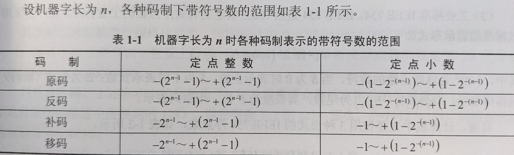

# 软考教程

## 第一章 计算机系统知识

### 组成：运算器，控制器， 存储器， 输入设备， 输出设备

> CPU(central processing unit): 运算器， 控制器等部件被集成在一起
>
> 存储器：分为内存(速度高， 容量小，临时存放)与外存(容量大， 速度慢，长久存放)
>
> 输入输出设备：键盘, 鼠标, 显示器等外设

### 中央处理单元

1. #### CPU的功能

   1. 程序控制
   2. 操作控制
   3. 时间控制
   4. 数据处理

2. #### CPU的组成

   1. 运算器(执行部件，全部操作有控制器指挥)
      1. 算数逻辑单元(ALU)
         1. 算数运算：加减乘除等
         2. 逻辑运算：与或非等
      2. 累加寄存器(AC)
         1. 通用寄存器
         2. 运算结果存储在这里
         3. 运算器中至少要有1个累加寄存器
      3. 数据缓冲寄存器(DR)
         1. 作为CPU和内存及外部设备之间数据传送的中转站
         2. 作为CPU和内存及外部设备之间在操作速度上缓冲
         3. 单AC结构中，可以兼作操作数寄存器
      4. 状态条件寄存器(PSW)
         1. 保存各种条件码内容，主要分为状态标志和控制标志
         2. 进位标志(C)
         3. 溢出标志(V)
         4. 为0标志(Z)
         5. 为负标志(N)
         6. 中断标志(I)
         7. 方向标志(D)
   2. 控制器
      1. 用于控制整个CPU的工作
      2. 指令控制逻辑-->取指，分析， 操作
         1. 指令寄存器(IR)
         2. 程序或指令记数器(PC)：顺序执行，转移执行
         3. 地址寄存器(AR)，保存当前CPU访问的内存单元地址
         4. 指令译码器(ID)，操作码，地址码
      3. 时序控制逻辑-->指令按时间书序提供控制信号
      4. 总线控制逻辑-->提供信息通路的控制电路
      5. 中断控制逻辑-->控制各种中断请求，根据优先级进行排队
   3. 寄存器组
      1. 专用寄存器-->作用固定，如运算器和控制器中的寄存器
      2. 通用寄存器
   4. 内部总线
   
3. 多核CPU

### 数据表示

1. 无符号数

   1. 小数点位置在机器数最低位之后-->纯整数
   2. 小数点位置在机器数最高位之前-->纯小数

2. 有符号数-->最高位表示正，负

3. 原码表示法，机器字长为n

   1. 最高位是符号位：0为+，1为-，其余的n-1位表示数值的绝对值

   2. 对于纯整数，取值范围是：2的n-1次方-1，n=8时，-127~127

   3. 对与数值0也存在两种表述，正负0

   4. 对于纯小数，取值范围与字长无关，均为-1~1

   5. 对于小数，小数点之后的第一位表示2的-1次方(1/2 = 0.5)，后续依次类推

      1. 0.5的原码表示为：0 .100 0000，第1位0表示整数

      2. -0.625的原码表示为：1.101 0000

         > 拆分2的n次方相加即可：0.625=0.5 + 0.125= 2的-1次方+2的-3次方，小数点后的第一位与第三位取1即可

4. 反码

   1. 最高位是符号位：0为+，1为-
   2. 正数的反码与原码相同
   3. 负数的反码在原码的绝对值位按位取反，如[-0]~反~= 1 111 1111

5. 补码

   1. 最高位是符号位：0为+，1为-
   2. 正数的补码与原码及反码相同
   3. 负数的补码等于其反码的末位+1
   4. 0有唯一的编码[-0]~补~ = 0 000 0000
   5. 纯整数时，补码的取值范围：-128~127

6. 移码

   1. 在数字X上增加1个偏移量来定义，通常用于表示浮点数中的阶码。
   2. 字长为n时，若偏移量为2的n-1次方，将补码的符号位取反即可

7. 定点数与浮点数

   1. 定点数

      1. 定点整数-->纯整数

      2. 定点小数-->纯小数

      3. 取值范围

         

   2. 浮点数

      1. 小数点位置不固定的数
      2. N = 2的E次方 x F，这里E为阶码，F为尾数。用阶码与尾数表示的数为浮点数
      3. 阶码为带符号的纯整数，尾数为带符号的纯小数
      4. 浮点数的表示格式为：阶符 | 阶码 | 数符 | 尾数
      5. 1个数的浮点表示不是唯一的。主要有小数点的位置决定
      6. 浮点数的数值范围主要由阶码决定，精度则由尾数决定