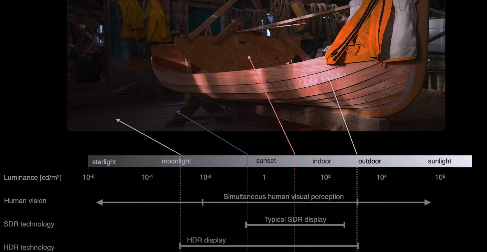
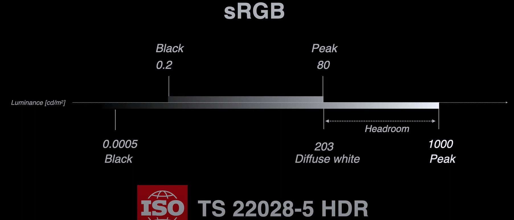
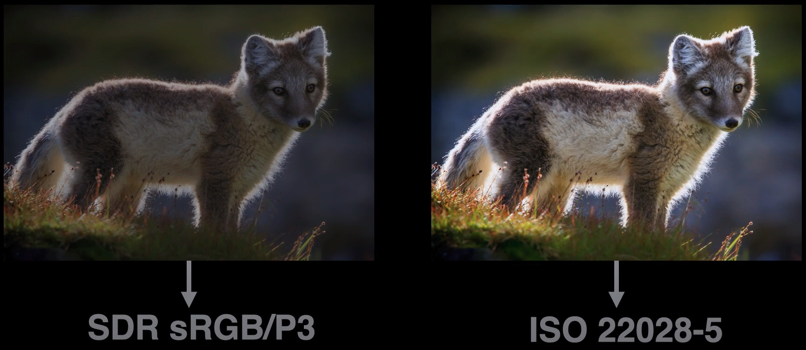
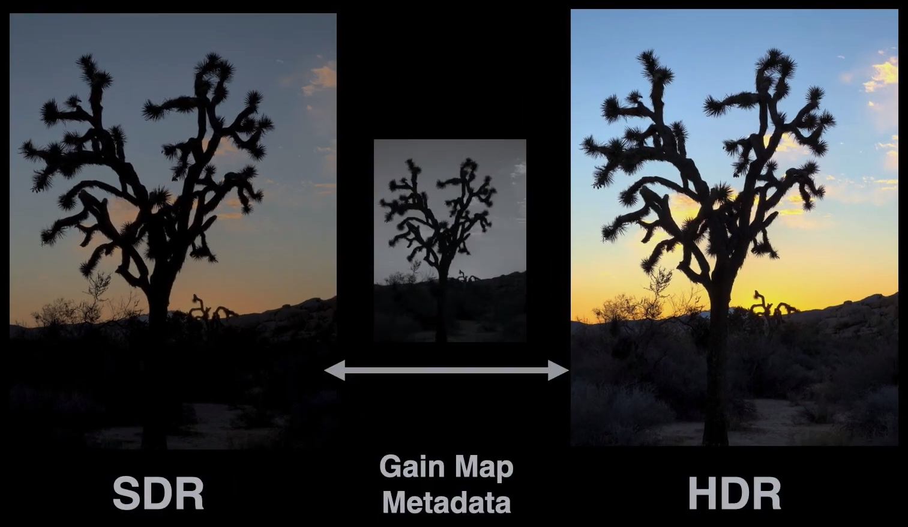
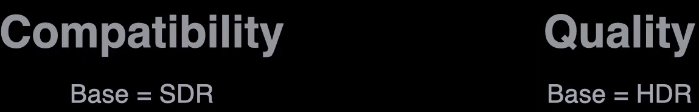

# HDR IMAGE

## 1.[视频](https://www.youtube.com/watch?v=HBVBLV9KZNI)

1. HDR(High Dynamic Range)高动态范围

2. SDR(Stard Dynamic Range)标准动态范围

3. SRGB

4. P3

5. ISO TS 22028-5 HDR

   

   

6. Gain Map

   

7. GainMap

   1. GainMap分辨率可与原图不一致
   2. GainMap可带色彩
   3. GainMap位深可与原图不一致
   4. GainMap压缩比例可与原图不一致

8. GainMpa与图片格式无关

9. GainMap元数据最终都使用XMP存储

10. 最终会体现在图片大小上

11. 如何选择

    

12. http://www.electronicimaging.org