# [Bazel](https://docs.engflow.com/docs/re/client/platform-options.html) Learn

## 0. 前置

|                                            |                                                              |
| ------------------------------------------ | ------------------------------------------------------------ |
| what                                       | 构建工具                                                     |
| where                                      | Windows、macOs、Linux                                        |
| when                                       | Java、C++、Android、iOS、Go等项目                            |
| who                                        | developer、(google)                                          |
| [why](https://github.com/bazelbuild/bazel) | 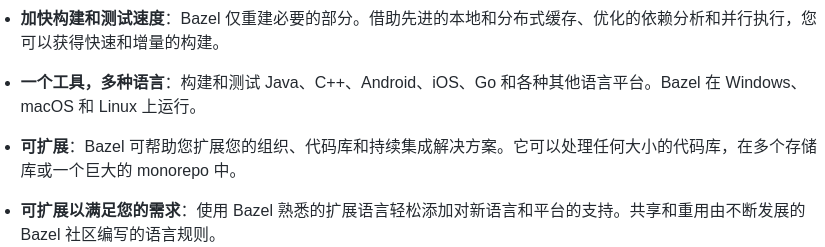 |

## 1.如何使用

1. [安装教程](https://bazel.build/install)

   1. 参考ubuntu执行即可

2. [开始使用](https://bazel.build/contribute)

   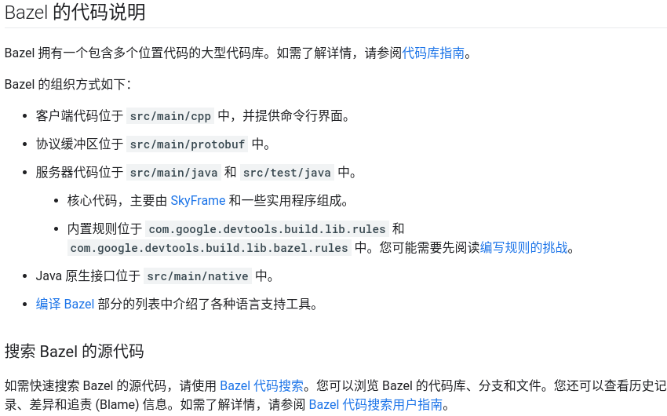

3. [源码搜索](https://cs.opensource.google/bazel)

   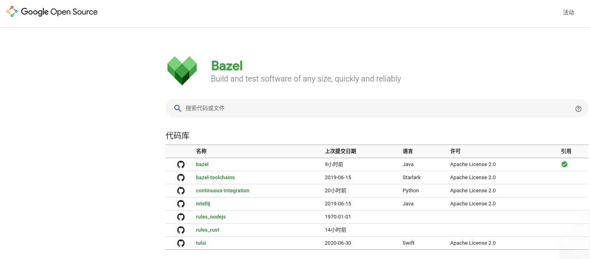

4. [编译文件学习](https://bazel.build/rules/rules-tutorial)

   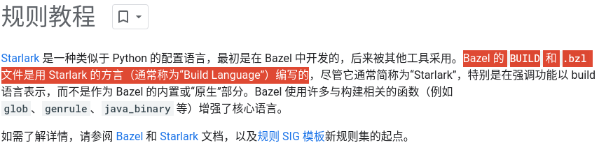
   
4. BUILD与.bzl[文件差异](https://bazel.build/rules/language)

   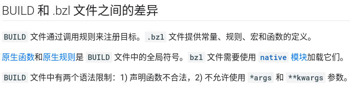

## 2.Bazel[可用命令](https://bazel.google.cn/run/build?authuser=0)

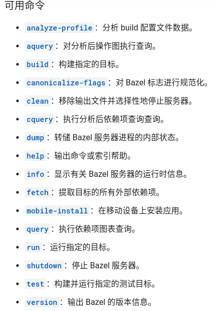

## 3.Build时做了什么

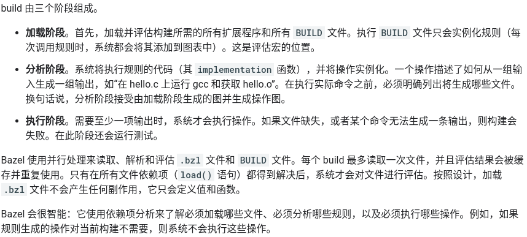

## 4.Bazel官网android demo[运行](https://bazel.build/start/android-app)

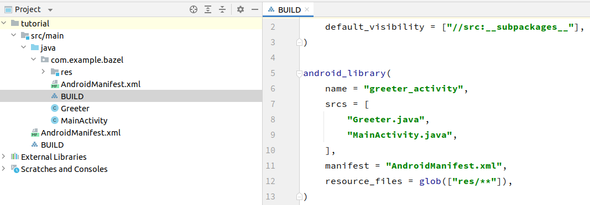

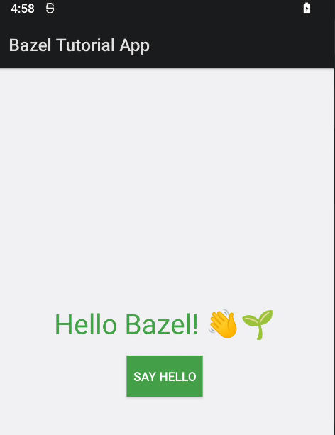

## 5.Android Studio[插件](https://ij.bazel.build/)

无法通过运行直接安装，应该时bazel的内部错误

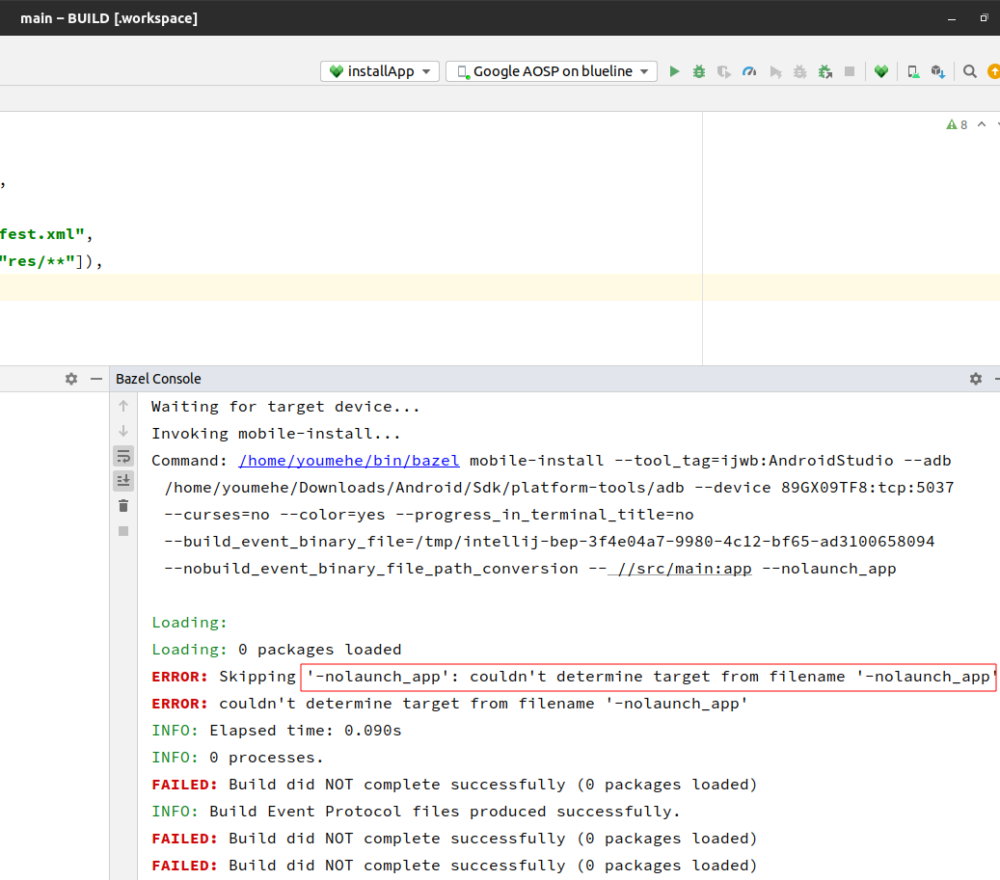

[drop-box发布的对比数据](https://dropbox.tech/mobile/modernizing-our-android-build-system-part-i-the-planning)

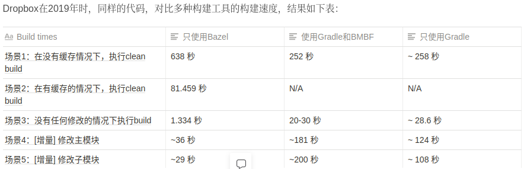

[Bazel VS Gradle](https://blog.csdn.net/apl359/article/details/118097896)