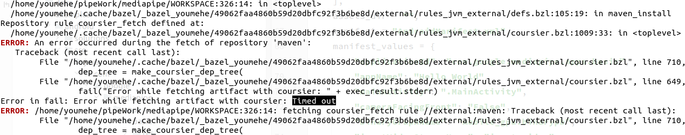
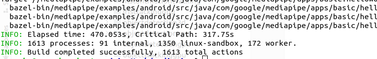
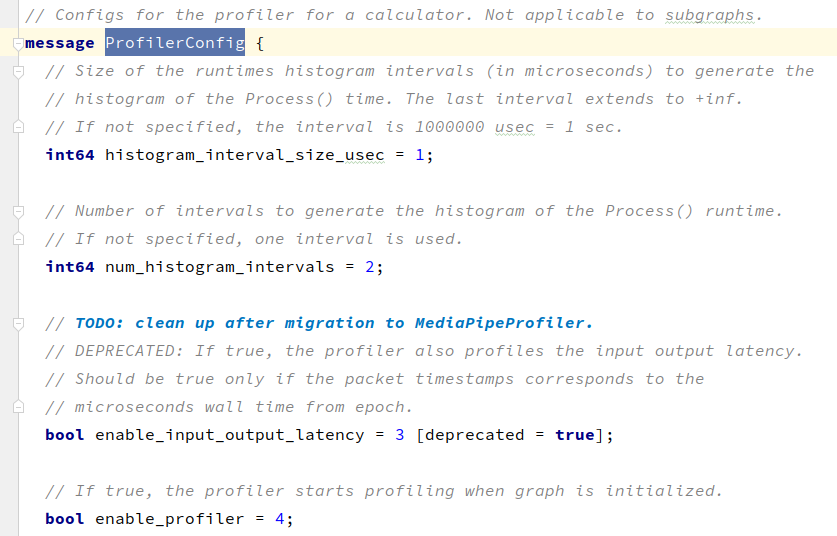
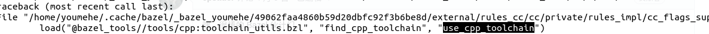
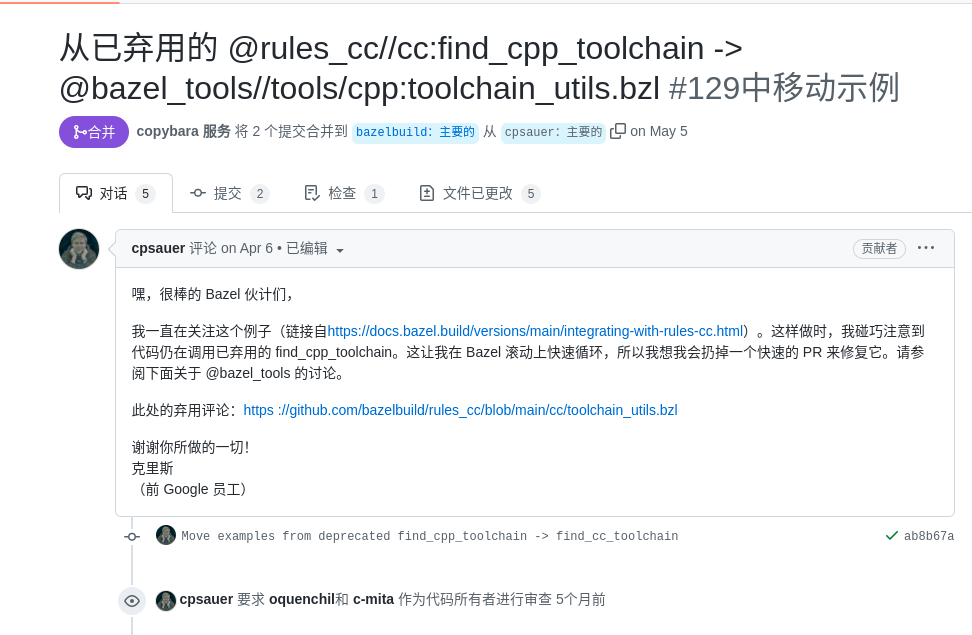
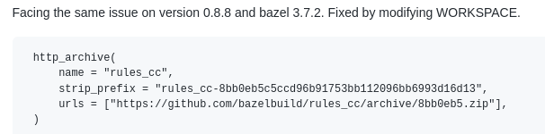
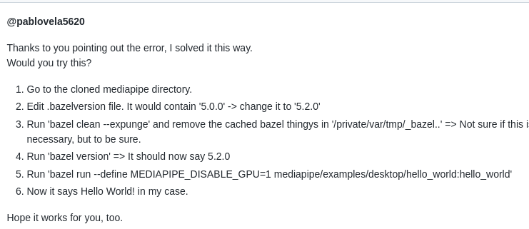
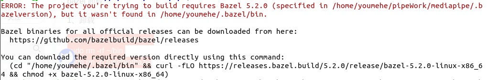
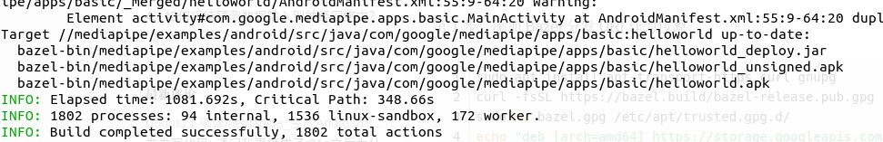

# MediaPipe Learn

## 1. 官网

https://google.github.io/mediapipe/

## 2. 源码

https://github.com/google/mediapipe

## 3. [Ubuntu环境配置](https://google.github.io/mediapipe/getting_started/install.html#installing-on-debian-and-ubuntu)

1. [ubuntu安装Bazel](https://bazel.build/install/ubuntu#run-installer)
   - 需要注意指定下载bazel版本以及对应的installer-linux-x86_64.sh
   - 需要注意ubuntu版本下载不同jdk
2. 下载mediaPipe源码
   - git clone https://github.com/google/mediapipe.git
   - 下载完成后注意对脚本添加执行权限, chmod +x  xxx.sh
3. 安装OpenCV及FFmpeg
   - 建议直接使用setup_opencv.sh脚本
4. 使用bazel执行Hello World示例
   - bazel run --define MEDIAPIPE_DISABLE_GPU=1 mediapipe/examples/desktop/hello_world:hello_world

## 4. [编译Android示例](https://google.github.io/mediapipe/getting_started/hello_world_android.html)

1. 执行setup_android_sdk_and_ndk.sh添加所需工具链

   

2. 执行编译命令

   - bazel build -c opt --config=android_arm64 mediapipe/examples/android/src/java/com/google/mediapipe/apps/basic:helloworld

   - 强依赖网络，若编译失败有timeOut关键字可以重复尝试(600s~700s左右)

     

   - 编译完成

     


## 5.solution

## 6.profiler

1、主要通过跟踪器、分析器完成性能分析

2、在calculator中存在Profile_config描述内容：

3、可应用在Linux，Android，ios

4、使用前提：

1. 分析库已链接(默认打开，通过编译时指定MEDIAPIPE_PROFILING指定)

   - 0--->关闭
   - 1--->打开

2. 配图中启用跟踪分析器

   - 官网配置示例(它打开跟踪并保持 100 秒的计时事件)

     ```protobuf
     profiler_config {
       trace_enabled: true #需要发出任何日志记录
       enable_profiler: true #提供离线分析所需的数据包级别信息
       trace_log_interval_count: 200 #???
       trace_log_path: "/sdcard/Download/"
     }
     ```

5、以Android设备为例：

1. 应用具有读写权限
2. 添加示例profiler_config配置
3. 使用bazel build编译app并安装
4. 打开应用程序运行一段时间
   1. 跟踪器将会保存文件至Download目录下
   2. 每5s后，写入转移到连续的跟踪日志文件
5. 下载文件，adb pull sdcard/Download/

6、真实实践

1. 上来直接编译报错了，使用如下命令清理下缓存
   1. bazel clean --expunge
   
2. 编译报错如下：

   

3. 进入rules_cc官网，查找到[对应修改如下](https://github.com/bazelbuild/rules_cc/blame/main/cc/private/rules_impl/compiler_flag.bzl)

   

4. 在网上找了下，[找到同样问题](https://github.com/google/mediapipe/issues/3457)：

   1. 解决方法一：

      

   2. 解决方法二：

      

5. 尝试使用2时发现bazel始终都是4.2.1，在官网上下载对应的5.2.0[版本进行安装](https://github.com/bazelbuild/bazel/releases?page=2)

6. 应该是由于电脑上有bazel，所以安装失败了，通过如下命令删除bazel

   1. sudo rm -rf /usr/bin/bazel
      sudo rm -rf ~/bin
      sudo rm -rf /usr/bin/bazel

7. mediaPipe出现如下提示：

   

8. 使用提示命令进行下载

   cd "/home/youmehe/.bazel/bin" && curl -fLO https://releases.bazel.build/5.2.0/release/bazel-5.2.0-linux-x86_64 && chmod +x bazel-5.2.0-linux-x86_64

9. 安装完成后进入mediaPipe代码中输入【bazel --version】，版本已经更新到了5.2.0

   

10. 接下来使用前文编译命令即可编译成功

    
