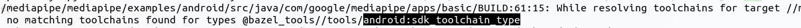

# MediaPipe Learn

## 1. 官网

https://google.github.io/mediapipe/

## 2. 源码

https://github.com/google/mediapipe

## 3. [Ubuntu环境配置](https://google.github.io/mediapipe/getting_started/install.html#installing-on-debian-and-ubuntu)

1. [ubuntu安装Bazel](https://bazel.build/install/ubuntu#run-installer)
   - 需要注意指定下载bazel版本以及对应的installer-linux-x86_64.sh
   - 需要注意ubuntu版本下载不同jdk
2. 下载mediaPipe源码
   - git clone https://github.com/google/mediapipe.git
   - 下载完成后注意对脚本添加执行权限, chmod +x  xxx.sh
3. 安装OpenCV及FFmpeg
   - 建议直接使用setup_opencv.sh脚本
4. 使用bazel执行Hello World示例
   - bazel run --define MEDIAPIPE_DISABLE_GPU=1 mediapipe/examples/desktop/hello_world:hello_world

## 4. [编译Android示例](https://google.github.io/mediapipe/getting_started/hello_world_android.html)

1. 执行setup_android_sdk_and_ndk.sh添加所需工具链

   

2. 执行编译命令

   - bazel build -c opt --config=android_arm64 mediapipe/examples/android/src/java/com/google/mediapipe/apps/basic:helloworld

   - 强依赖网络，若编译失败有timeOut关键字可以重复尝试(600s~700s左右)

     

   - 编译完成

     

