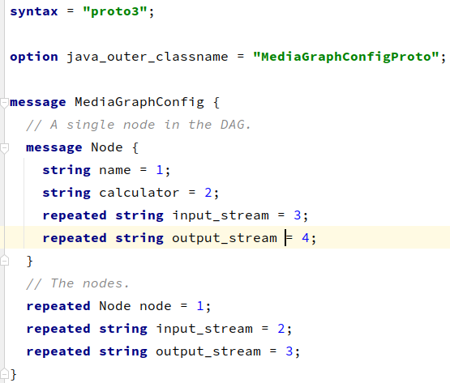
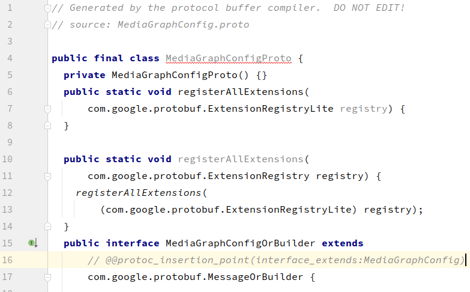
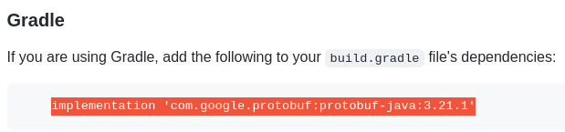
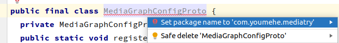
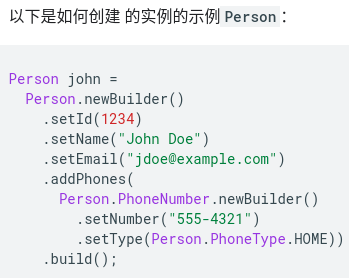
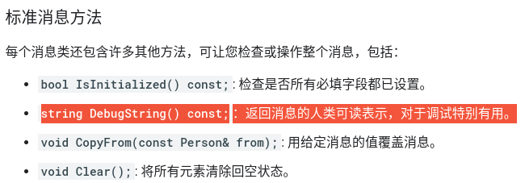
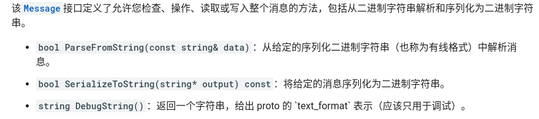
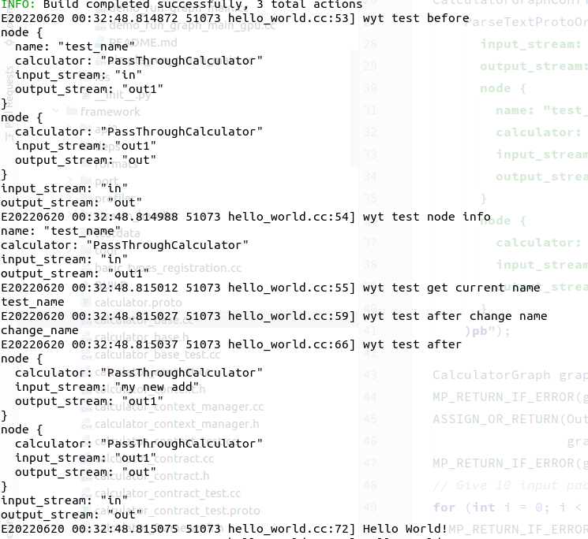
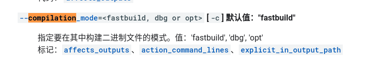
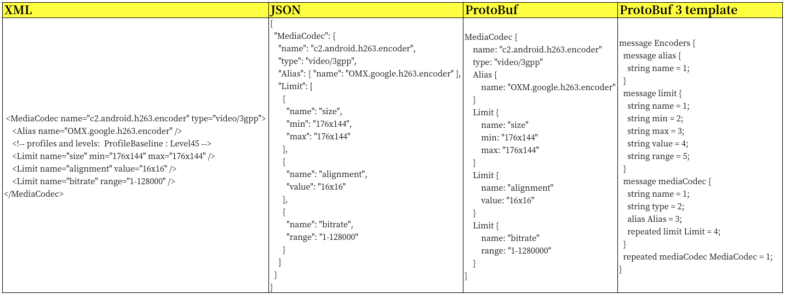

# Proto Learn

## 1. 官网

https://developers.google.com/protocol-buffers/docs/overview

## 2. 工作流


## 3. 实践工作流

1. 创建proto文件定义数据

   

   - 第一行声明使用版本为proto3
   - 第二行声明编译生成java类名
   - repeated声明该字段可有多个
   - 详细内容可见[proto3语法指南](https://developers.google.com/protocol-buffers/docs/proto3)

2. 下载proto编译器

   - https://github.com/protocolbuffers/protobuf/releases/tag/v21.1 
   - linux可以直接使用命令安装: sudo apt  install protobuf-compiler

3. [参考官网编译proto文件至java文件](https://developers.google.com/protocol-buffers/docs/javatutorial#compiling-your-protocol-buffers)

   - protoc --java_out=./ MediaGraphConfig.proto

     

   - [根据官网指导导包](https://github.com/protocolbuffers/protobuf/tree/main/java)

     

   - proto中未指定packeName,导致生成文件缺少报名,按照提示添加即可

     

   

4. 在项目中使用

   - [参考官网构造对象](https://developers.google.com/protocol-buffers/docs/javatutorial#builders)

     


other





// 官方部分代码划分

https://developers.google.com/protocol-buffers/docs/reference/cpp


// C++官方使用

https://developers.google.com/protocol-buffers/docs/reference/cpp-generated





基本尝试成功

```c++
LOG(ERROR) << "wyt test before \n" << config.DebugString();
LOG(ERROR) << "wyt test node info\n" << config.node().Get(0).DebugString();
LOG(ERROR) << "wyt test get current name\n" << config.node().Get(0).name();
CalculatorGraphConfig::Node node = config.node().Get(0);
node.mutable_name();
node.set_name("change_name");
LOG(ERROR) << "wyt test after change name \n" << node.name();
CalculatorGraphConfig::Node* nodeDef = config.mutable_node(0);
nodeDef->mutable_name();
nodeDef->set_name("my new add");
nodeDef->set_input_stream(0,  "my new add");
nodeDef->clear_name();
//config.clear_node();
LOG(ERROR) << "wyt test after \n" << config.DebugString();
// Close the input stream "in".
MP_RETURN_IF_ERROR(graph.CloseInputStream("in"));
mediapipe::Packet packet;
// Get the output packets string.
while (poller.Next(&packet)) {
  LOG(ERROR) << packet.Get<std::string>();
}
return graph.WaitUntilDone();
```





Bazel[编译选项](https://bazel.build/reference/command-line-reference)




https://stackoverflow.com/questions/45007565/protobuf-android-includes-build-type-in-generated-folders





xml

<MediaCodec name="c2.android.h263.encoder" type="video/3gpp">

​    <Alias name="OMX.google.h263.encoder" />

​    <!-- profiles and levels:  ProfileBaseline : Level45 -->

​    <Limit name="size" min="176x144" max="176x144" />

​    <Limit name="alignment" value="16x16" />

​    <Limit name="bitrate" range="1-128000" />

</MediaCodec>

Json

<pre>
{
  "MediaCodec": {
    "name": "c2.android.h263.encoder",
    "type": "video/3gpp",
    "Alias": { "name": "OMX.google.h263.encoder" },
    "Limit": [
      {
        "name": "size",
        "min": "176x144",
        "max": "176x144"
      },
      {
        "name": "alignment",
        "value": "16x16"
      },
      {
        "name": "bitrate",
        "range": "1-128000"
      }
    ]
  }
}
</pre>


ProtoBuf

<pre>
MediaCodec {
    name: "c2.android.h263.encoder"
    type: "video/3gpp"
    Alias {
        name: "OXM.google.h263.encoder"
    }
    Limit {
        name: "size"
        min: "176x144"
        max: "176x144"
    }
    Limit {
        name: "alignment"
        value: "16x16"
    }
    Limit {
        name: "bitrate"
        range: "1-1280000"
    }
}
</pre>


ProtoBuf3 Template

<pre>
message Encoders {
  message alias {
    string name = 1;
  }
  message limit {
    string name = 1;
    string min = 2;
    string max = 3;
    string value = 4;
    string range = 5;
  }
  message mediaCodec {
    string name = 1;
    string type = 2;
    alias Alias = 3;
    repeated limit Limit = 4;
  }
  repeated mediaCodec MediaCodec = 1;
}
</pre>

