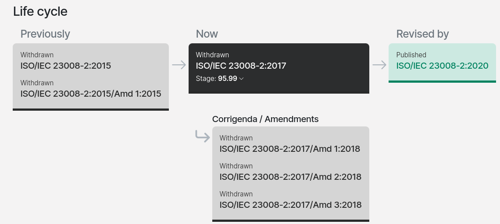

# HDR

----

ISO/IEC 23008-2:2017

https://www.iso.org/standard/69668.html

https://www.iso.org/obp/ui/en/#iso:std:iso-iec:23008:-1:ed-3:v1:en

https://standards.iteh.ai/catalog/standards/iso/2a567491-56f1-4ec6-9b95-9119bc459d9c/iso-iec-tr-23008-15-2018

https://www.quora.com/How-I-can-download-a-PDF-for-the-ISO-standards-free

mastering display color volume

https://encyclopedia.pub/entry/32320

https://ieeexplore.ieee.org/stamp/stamp.jsp?tp=&arnumber=8353899

https://ieeexplore.ieee.org/document/8353899

https://developer.apple.com/documentation/quartzcore/caedrmetadata/3194382-hdr10/

https://developer.apple.com/av-foundation/High-Dynamic-Range-Metadata-for-Apple-Devices.pdf

https://www.moneymakerphotography.com/primer-history-use-hdr-photography/