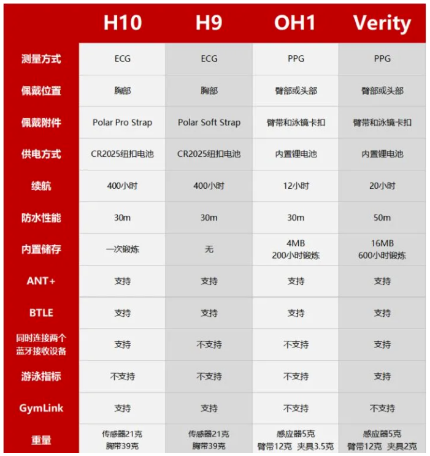
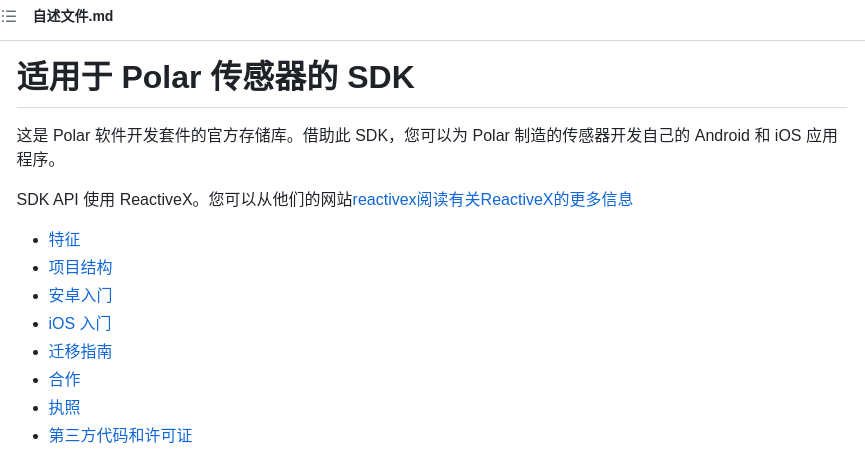
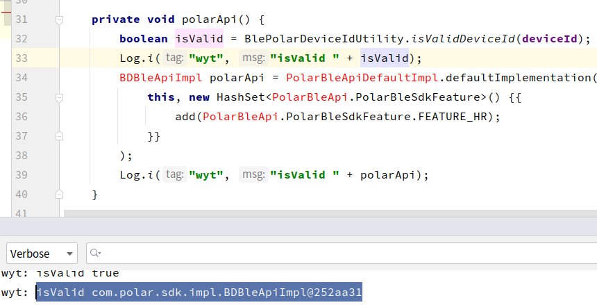
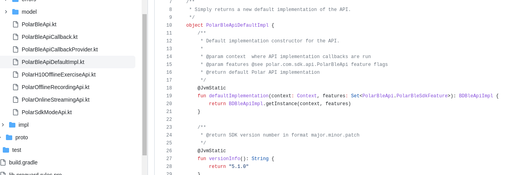
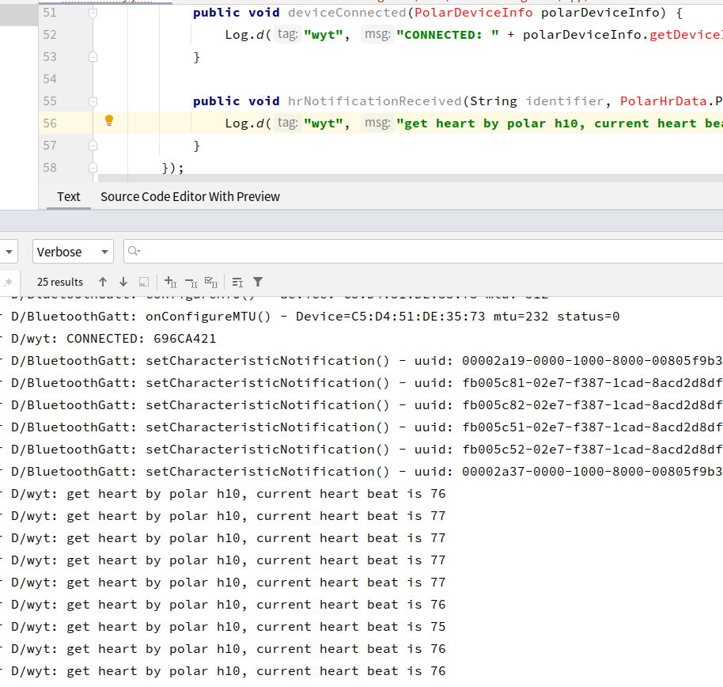
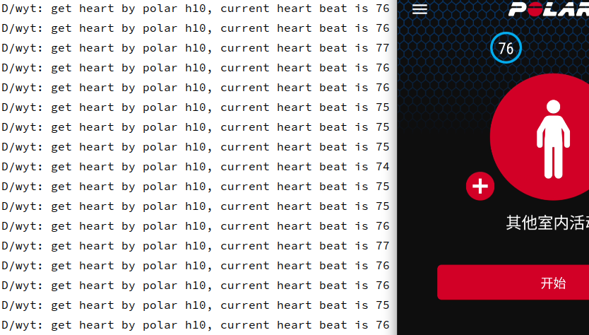

# Polar应用

----

## 0. 背景

1. 目前使用的是h10，虽然没怎么用过，一年也就不到10次，最近想在手表上用，准备接下sdk在手表上显示下实时心率
2. 不知道啥时候开始计算的消耗也不准了，这也是一部分原因

## 1. 周边信息

1. polar sensor[设备对比](https://zhuanlan.zhihu.com/p/354612618)(2023.07.16)

   

2. polar部分的官网[sdk](https://github.com/polarofficial/polar-ble-sdk)

   

## 2. 开发

1. 按照官方demo添加依赖后运行报错参考该[提问解决](https://github.com/polarofficial/polar-ble-sdk/issues/136)，目前已经可以初始化api，不过飘红跟无提示问题赞为解决，可能与sdk是kt编写的有关

   

   

2. 好了，一顿折腾，终于是给连接上出数据了

   

3. 正好H10支持双设备，可以测试一下他家应用跟日志数据正好，数据跟预期一样正常

   

4. 接下来接着梳理下逻辑，搞个桌面小组件或者在手表上做个demo，还是得想办法解决掉不提示的问题，要不真的太麻烦了

项目配置调整

https://blog.csdn.net/qq_41811862/article/details/121114332