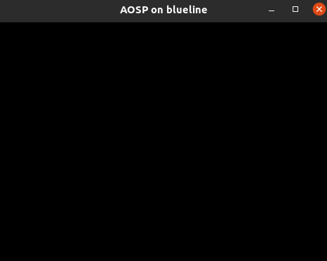
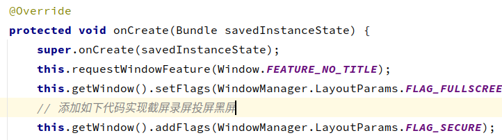
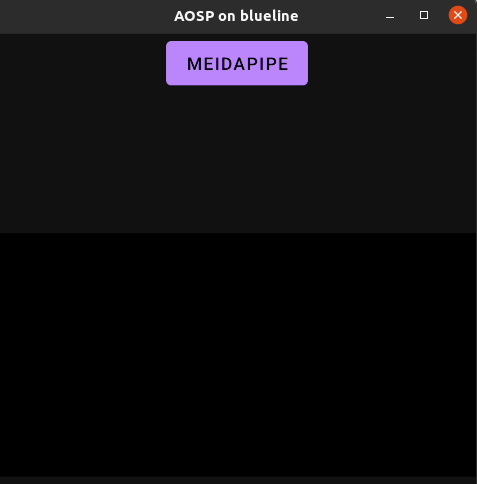
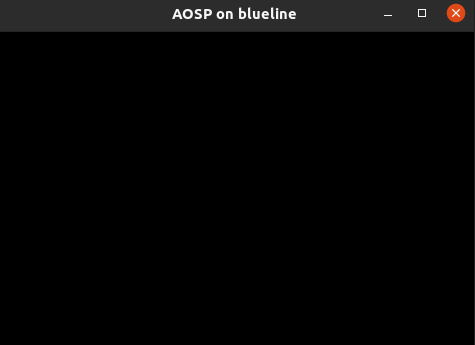
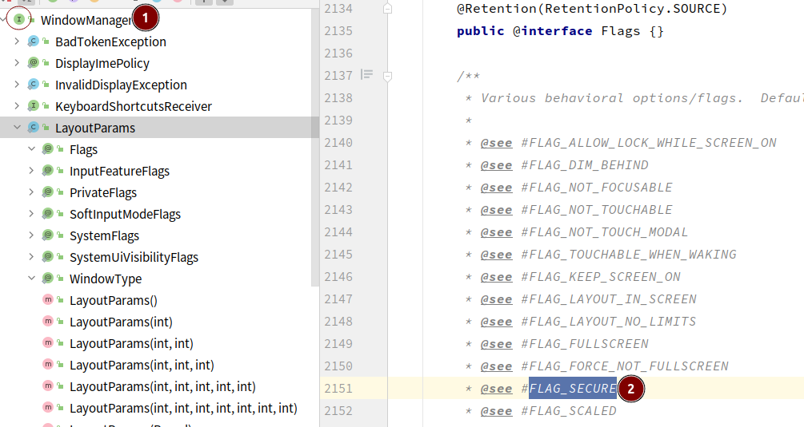
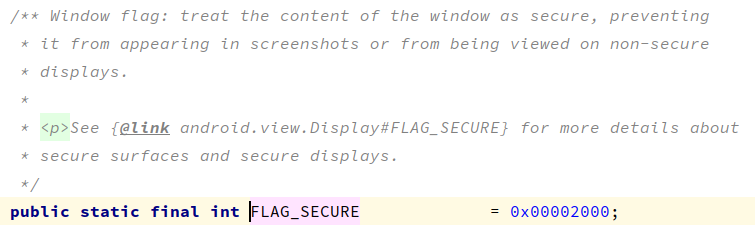
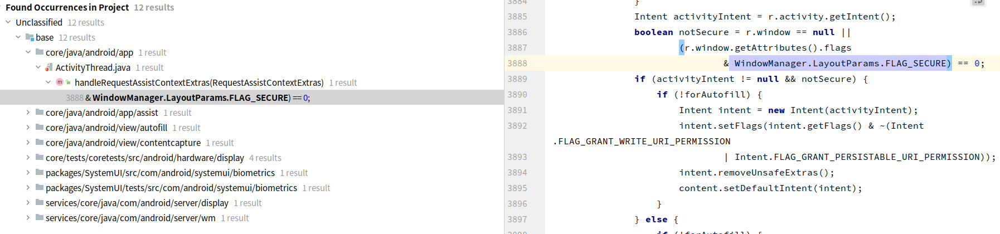
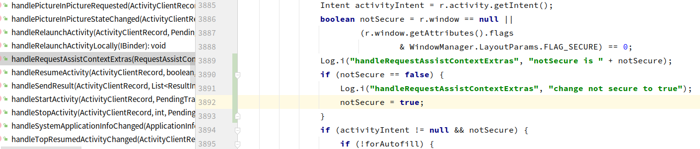
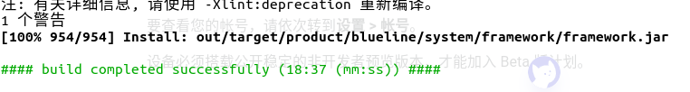
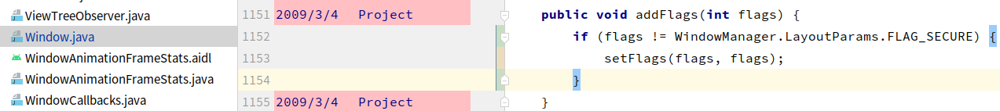

# 投截录屏黑屏

---

## 1. 问题背景

1. 使用部分软件时希望投屏到电脑上，电脑端确出现黑屏， 投屏截屏录屏时发现内容均为黑色

## 2. 解决思路

1. 按照经验来说应该是设置了flag_secure标志，切换其他界面发现都是黑屏，那么应该实在application全局设置，不过手机已经root了，且系统源码存在，尝试修改框架层源码解决该问题

## 3. 修改记录

1. 编写demo添加**FLAG_SECURE**，添加代码前后投屏效果如下

   

   

2. 查看源码，可以得知**WindowManager**是一个接口

   

   

3. 在base仓下搜索**WindowManager.LayoutParams.FLAG_SECURE**得到如下信息

   

4. 按照注释跳转来看wm跟display都是会作用到的，不过既然**ActivityThread**都出来了那就直接从这里入手，添加如下代码强行将**notSecure**调整到**true**

   

5. 编译**framework-minus-apex**后替换重启(需要删除oat及arm,arm64，直接push可能会起不来)

   

   ```sh
   adb root
   adb remount
   adb shell rm -rf system/framework/oat/
   adb shell rm -rf system/framework/arm/
   adb shell rm -rf system/framework/arm64/
   adb push out/target/product/blueline/system/framework/framework.jar system/framework/
   ```

6. 替换后手机app打开直接闪退crash，直接删除了out目录，从头编译源码刷机但是代码该部分修改好像没带上，再次编译framework.jar替换后还是打开app闪退，堆栈来看时空指针，最后查了半天，参考如下几个连接修复了，不用删除arm，arm64，需要替换oat目录资源即可，最终编写脚本如下

   https://blog.csdn.net/qq_41811862/article/details/121114332

   http://t.zoukankan.com/zhhd-p-5790448.html

   ```sh
   adb root
   adb remount
   adb shell rm -rf system/framework/oat/
   adb push oat/ /system/framework/
   adb push framework.jar /system/framework/
   adb shell am restart
   ```

7. 替换生效了已经，不过执行demo发现ActivityThread的日志未打印，后来一想那需要这么麻烦，既然是添加flag，那么直接找到添加Flag的接口，在框架层判断如果是FLAG_SECURE德华不添加就好了，代码如下

   

8. 测试了下已经没有问题了，投屏正常，不过由于想要看的界面是webView，且Activity做了不能旋转处理，最后查了下scrcpy的功能，直接Alt + ←或Alt + 右即可完成投屏的方向旋转，已满足当前

9. 其实手机已经root了，按道理来说还可以试试通过直接dump解码信息试试，不过感觉不太实际，一个是数据太大，一个是查看了下这个FLAG的相关数据，如果上了这个FLAG，那么在渲染的时候也会对数据做处理，同时使用得是webView，也很有可能走了自己的解码器，不过还是可以试试看，目前使用的时高通手机，dump解码命令如下：

   ```
   echo decoder
   adb shell setenforce 0
   adb shell mkdir /data/vendor/media/qc2/
   adb shell setprop vendor.qc2.log.buffer 0x1003
   pause
   ```

   

6. 


https://developer.qualcomm.com/qualcomm-robotics-rb5-kit/software-reference-manual/camera-and-video/video-decode


### linux add swap

https://blog.csdn.net/a1150162163/article/details/129521228