# Running CTS tests

## 1. how to get test suite

1. download from [Google](https://source.android.com/compatibility/cts/downloads)
2. download source code from [Google then make cts](https://github.com/CatLittleLazy/videoCodec/blob/main/android.md)
2. the source code in [cts](https://cs.android.com/android/platform/superproject/+/master:cts/)

## 2. [run with test environment](https://source.android.com/compatibility/cts/run)

0. This way is good for testing all modules or checking if some changes will generate errors

1. enter test environment

   ```sh
   ./android-cts/tools/cts-tradefed
   ```

2. Common test commands
   
   ```sh
   //run all
   run cts
   //run the module,eg: CtsMediaTestCases
   run cts -m CtsMediaTestCases
   //run more than one modules,eg: CtsMediaTestCases,CtsMediaVideoTestCases
   run cts --include-filter "CtsMediaTestCases" --include-filter "CtsVideoTestCases"
   //run the cases,eg: testAvcGoog0Perf0320x0240
   run cts -m CtsVideoTestCases -t android.video.cts.VideoEncoderDecoderTest#testAvcGoog0Perf0320x0240
   //run more than one test cases,eg:testAvcGoog0Perf0320x0240,testPlayAudioMp3
   run cts --include-filter "CtsVideoTestCases android.video.cts.VideoEncoderDecoderTest#testAvcGoog0Perf0320x0240" --include-filte "CtsMediaTestCases android.media.cts.testPlayAudioMp3#testPlayAudioMp3"
   //run without check
   run cts-dev .....
   //run with one abi
   run xxxxxxxxxx --abi arm64v8
   //retry test,use l r get the test session at first
   run retry --retry sessionId
   //run the test cases with max retry count
   run cts -m CtsVideoTestCases -t android.video.cts.VideoEncoderDecoderTest#testAvcGoog0Perf0320x0240 --retry-strategy ITERATIONS --max-testcase-run-count 10
   ```
   
3. [result and log](https://source.android.com/compatibility/cts/interpret)

   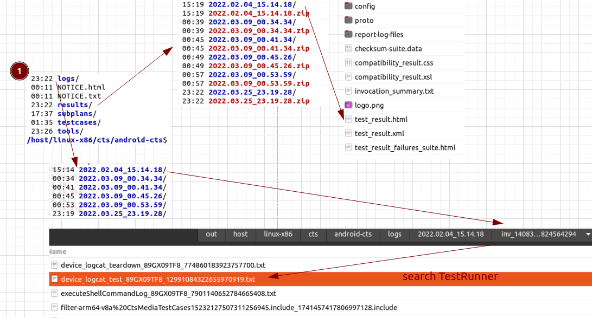


## 3. run with adb commands

0. This way is suitable for analyzing cts failure test cases

1. install the test Module apk at first, eg: CtsMediaTestCases

   ```sh
   //u will find this apk file in android-cts/testcases/ dir
   adb install CtsMediaTestCases.apk
   //grant permissions,eg. CAMERA
   adb shell pm grant android.media.cts android.permission.CAMERA
   //run test,eg testPlayAudioMp3
   adb shell am instrument -e class android.media.cts.MediaPlayerTest#testPlayAudioMp3 -w android.media.cts/androidx.test.runner.AndroidJUnitRunner
   //run all the test class,eg:MediaSyncTest
   adb shell am instrument -e class android.media.cts.MediaSyncTest -w android.media.cts/androidx.test.runner.AndroidJUnitRunner
   ```

2. in fact,the testPlayAudioMp3 test case needs some source file: testmp3_2.mp3, so we should push this file to phone before run adb command

   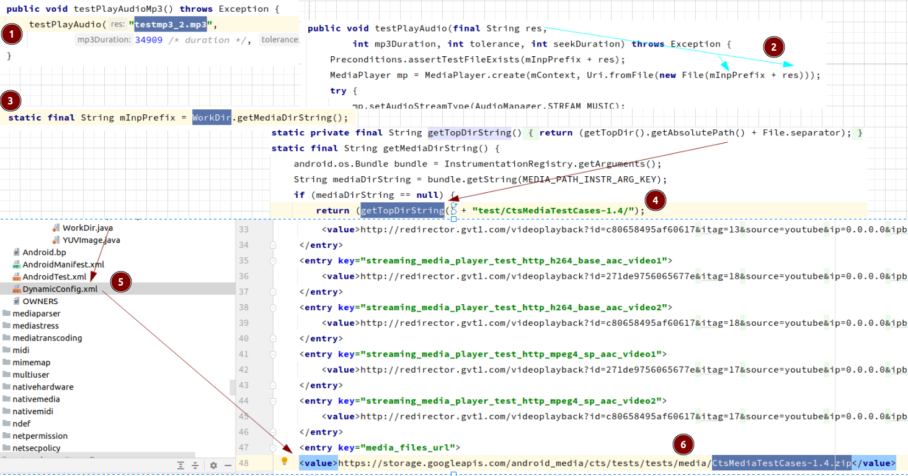

3. we can just push this file to phone,or run copy_media.sh to push all files to phone

   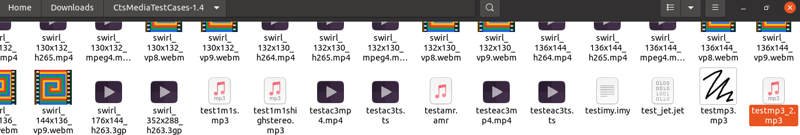

   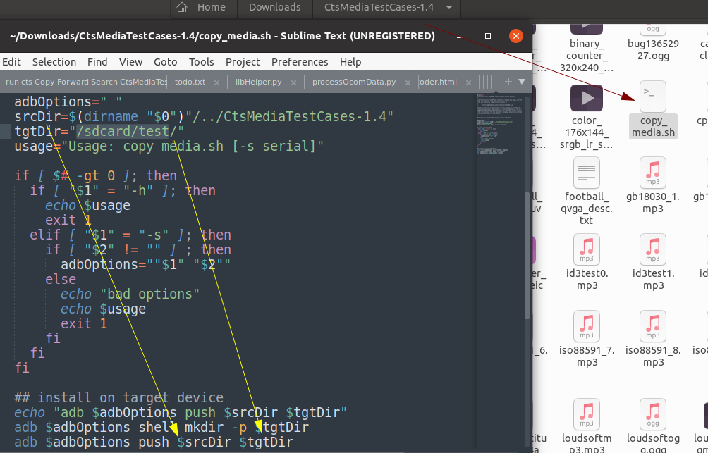

4. if u have already pushed source files on the phone,but test app can't read ,u should do this prerequisite

   1. install [TradefedContentProvider.apk](https://github.com/CatLittleLazy/videoCodec/tree/main/cts/CtsMediaTestCases) and grant premission

   2. push [CtsMediaTestCases.dynamic](https://github.com/CatLittleLazy/videoCodec/blob/main/cts/CtsMediaTestCases/CtsMediaTestCases.dynamic)(add this node)

      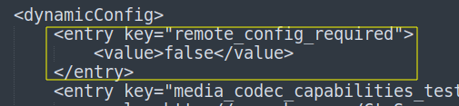
   
5. result

   

   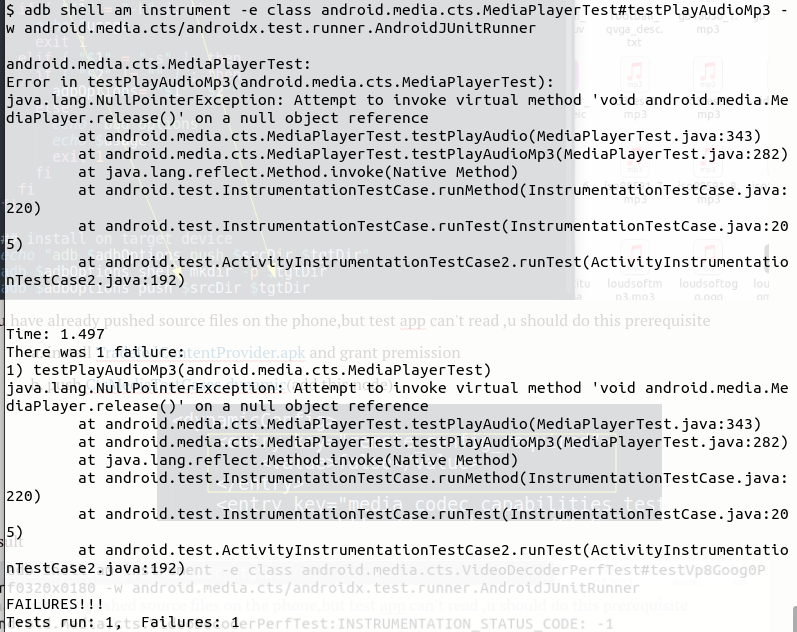

   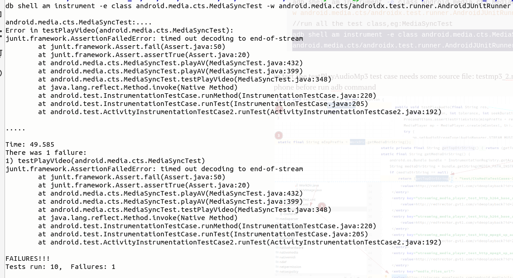

6. log

   ```sh
   //you should get the applog when you are testing by this command 
   adb logcat -c & adb logcat > testLog.txt
   ```
   
7. [fast run](https://github.com/CatLittleLazy/videoCodec/tree/main/note/cts/FastTest)

## 4. analyzing failure test case

1. run with adb command

   ```sh
   adb shell am instrument -e class android.media.cts.MediaPlayerTest#testPlayAudioMp3 -w android.media.cts/androidx.test.runner.AndroidJUnitRunner
   ```
   
2. result

   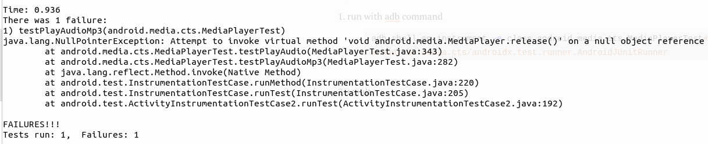

3. see the source code

   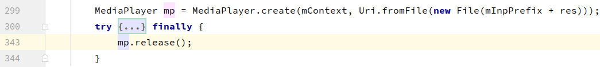

4. see the log

   1. search the key work testRunner

      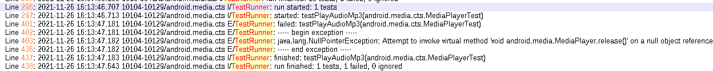

   2. find the failure reason

      

   3. make sure the file exist

      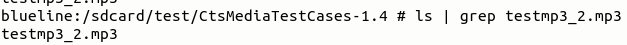

   4. try to run with test suite

      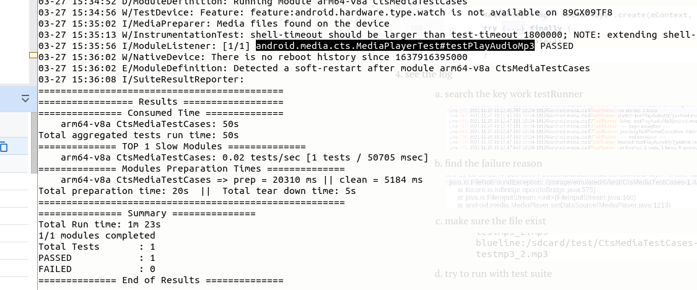

   5. try to test the video test with adb command

      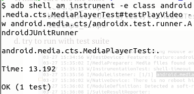

   6. use demo to read this dir

      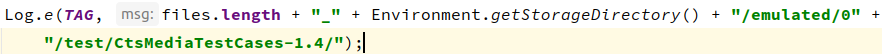

      

   7. when the app have the runtime permission, will read all files:

      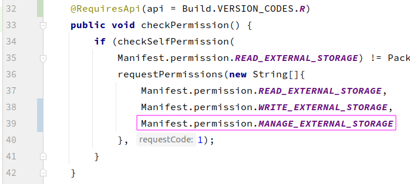

      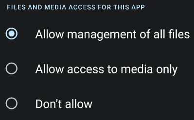

      

   8. the CtsMediaTestCases  without this permission

      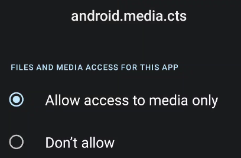

   9. after add run time grant MANAGE_EXTERNAL_STORAGE code in cts source code,the test cases will pass

      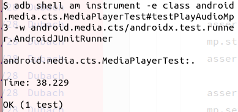
   
   10.  in fact, we should read these documents about MANAGE_EXTERNAL_STORAGE permisson
   
      1. https://developer.android.com/training/data-storage/shared/media#storage-volume
      2. https://developer.android.com/training/data-storage/manage-all-files
      3. https://developer.android.com/about/versions/11/privacy/storage
      4. https://developer.android.com/guide/topics/permissions/overview#runtime

## 5. new knowledge

1.  [AppOps](https://developer.android.com/guide/topics/permissions/overview#runtime)

   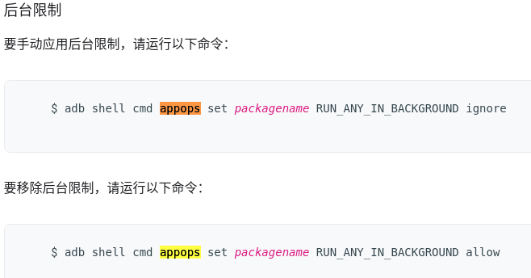

   ```sh
   adb shell appops set --uid PACKAGE_NAME MANAGE_EXTERNAL_STORAGE allow
   ```

2. adb shell dumpsys package packageName

   

3. [shizuku](https://shizuku.rikka.app/zh-hant/)

