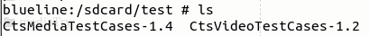

# CtsSource Download

## 1. google [source](https://source.android.com/compatibility/cts/downloads#cts-media-files)

> vpn get

## 2. source [get](http://youmehe.wang/CtsSource/)

| file                                                         | detail                                    |
| ------------------------------------------------------------ | ----------------------------------------- |
| [CtsMediaTestCases-1.4.zip](http://youmehe.wang/CtsSource/CtsMediaTestCases-1.4.zip) | for CtsMediaTestCases perf test cases     |
| [CtsVideoTestCases-1.2.zip](http://youmehe.wang/CtsSource/CtsVideoTestCases-1.2.zip) | not for CtsVideoTestCases perf test cases |
| [CtsMediaTestCases.zip](http://youmehe.wang/CtsSource/CtsMediaTestCases.zip) | for all CtsMediaTestCases                 |
| [ ctsPerfTools.zip](http://youmehe.wang/CtsSource/ctsPerfTools.zip) | for cts media perf tools                  |

> all these files should push on sdcard/test/ dir
>
> 

