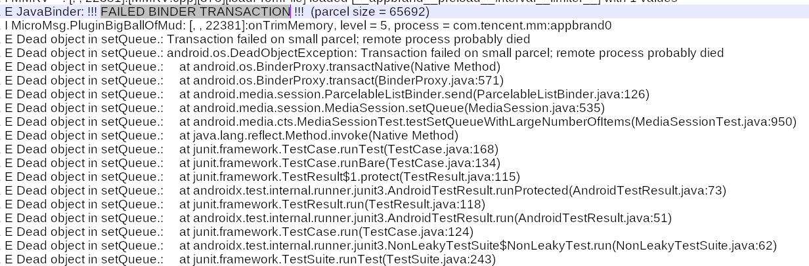
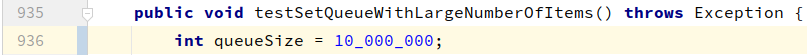
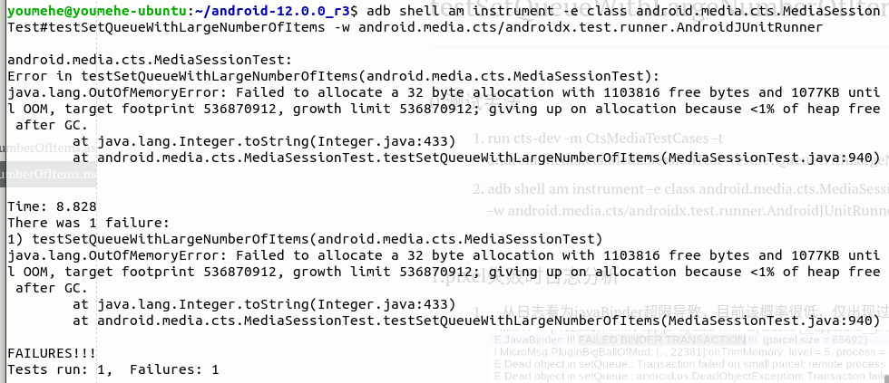
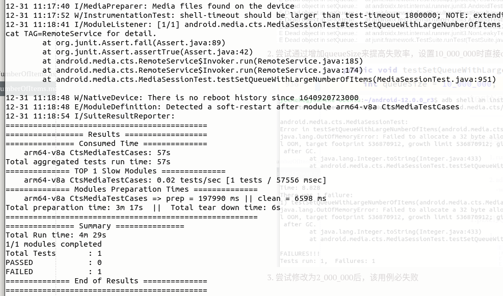

# testSetQueueWithLargeNumberOfItems

### 0.测试手法

1. run cts-dev -m CtsMediaTestCases -t android.media.cts.MediaSessionTest#testSetQueueWithLargeNumberOfItems
2. adb shell am instrument -e class android.media.cts.MediaSessionTest#testSetQueueWithLargeNumberOfItems -w android.media.cts/androidx.test.runner.AndroidJUnitRunner

### 1.pixel失败时日志分析

1. ​	从日志看为javaBinder超限导致，目前该概率很低，仅出现过一次

   

2. 尝试通过增加queueSize来提高失败率，设置10_000_000时直接oom，2_000_000时依旧通过

   

   

3. 尝试修改为5_000_000后，该用例必失败

   

### 2.简单分析用例代码

1. ​	创建mediaSession后，在其中放入1_000_000条数据