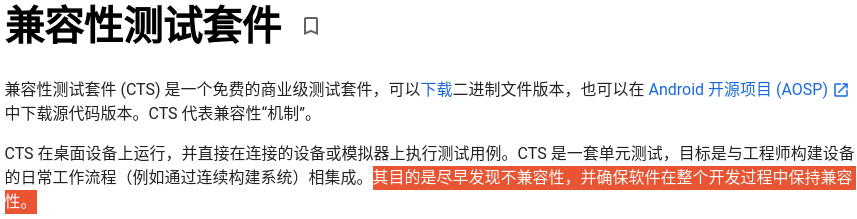
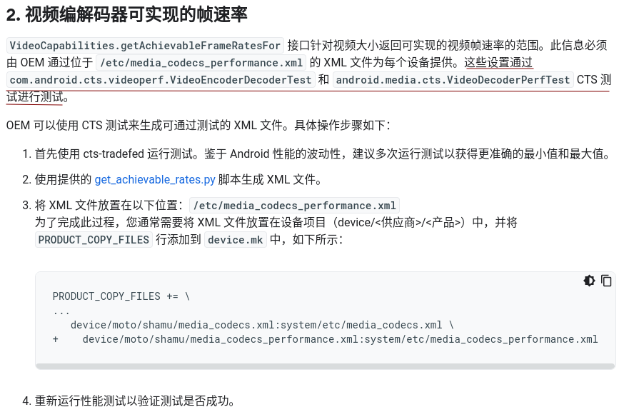
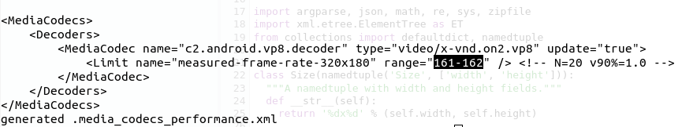
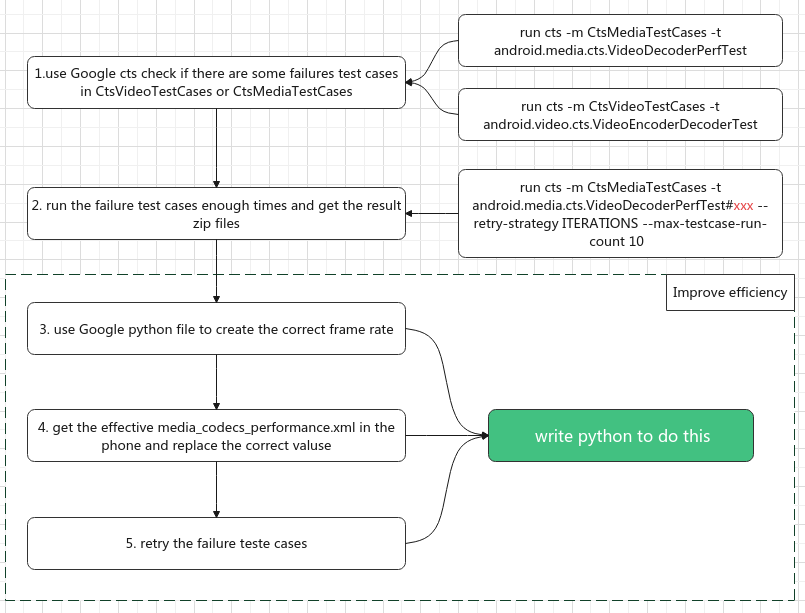
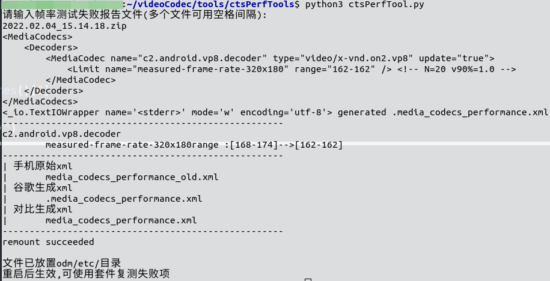
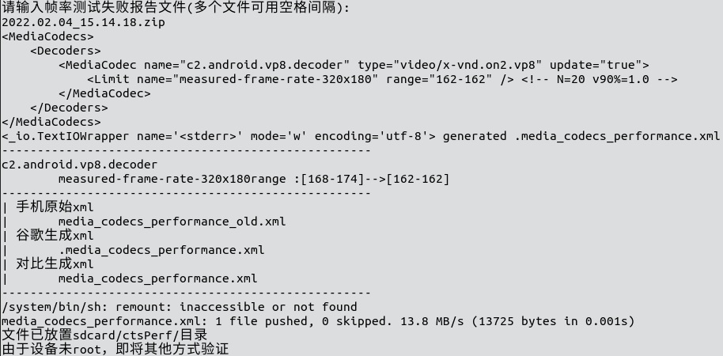

# one tools for android MediaPerf Cts

## 0. before start

|                                                              |                                                              |
| ------------------------------------------------------------ | ------------------------------------------------------------ |
| [what](https://source.android.com/compatibility/cts)         |  |
| where                                                        | NA                                                           |
| when                                                         | NA                                                           |
| who                                                          | NA                                                           |
| [why](https://source.android.com/devices/media/oem#2_achievable_frame_rates_for_video_codecs) | we should try to test these test cases for getting the correct values of xml, and these values depends on the 性能 with the phone, maybe we have to change lots of times  |

## 1. how

1. use Google cts check if there are some failures test cases in CtsVideoTestCases or CtsMediaTestCases
2. run the failure test cases enough times and get the result zip files
4. use Google python file to create the correct frame rate
5. get the effective media_codecs_performance.xml in the phone and replace the correct valuse
6. retry the failure teste cases

### 1.1 check test result

1. enter test suit and run these commands
   ```sh
   run cts -m CtsMediaTestCases -t android.media.cts.VideoDecoderPerfTest
   run cts -m CtsVideoTestCases -t android.video.cts.VideoEncoderDecoderTest
   ```
   > these tests total  1044 = (156 + 366) x 2  may cost 3 hours, after test, check the result to make sure how many failures there are

### 1.2 get the retry zip

1. we get the retry the failure test enough times like this
   ```sh
   run cts -m CtsMediaTestCases -t android.media.cts.VideoDecoderPerfTest#testVp8Goog0Perf0320x0180 --retry-strategy ITERATIONS --max-testcase-run-count 10  
   ```
   
   - aoe
   
   > after read the python source code,u will find the result which created by run videoTestCase and mediaTestCases one time is useless,so we should create the result one module by one 

### 1.3 get the correct value

1. get the [get_achievable_rates.py](https://cs.android.com/android/platform/superproject/+/master:cts/tools/cts-media/get_achievable_rates.py)

2. use like these

   ```python
   python2 get_achievable_rates.py --ignore xxx.zip xxx.zip xxx.zip
   ```
3. then, u will have correct value
   


### 1.4 get the xml which we should replace

1. use this command to get result if this xml file had [**customized**](https://android-review.googlesource.com/c/platform/frameworks/av/+/1253068)
   ```sh
   adb shell getprop ro.media.xml_variant.codecs
   ```
2. we should get the media_codecs_performance_result.xml in a certain order like these product/etc/, odm/etc/, vendor/etc/, system/etc/
   ```sh
   adb pull vendor/etc/media_codecs_performance_xxx.xml
   ```
3. then find the values by python result which we should change
   > we can search the value which in failure result: "30-31"
   >
   > 

4. after replace the correct value, make it effect

   ```sh
   adb root
   adb remount
   adb push media_codecs_performance_xxx.xml product/etc/
   adb reboot
   ```

### 1.5 retry failure test

1. u can retry the failure test case by test suit or use these command
   ```sh
   adb shell am instrument -e class android.media.cts.VideoDecoderPerfTest#testVp8Goog0Perf0320x0180 -w android.media.cts/androidx.test.runner.AndroidJUnitRunner
   ```
   
2. if u have too many failures, u can write this command repeat, and change the end with bat or sh

   > https://github.com/CatLittleLazy/videoCodec/blob/main/note/cts/Cts.md#3-run-with-adb-commands

## 2. which step can be improved



## 3. Python

1. [step 3 to 4](https://github.com/CatLittleLazy/videoCodec/blob/main/tools/ctsPerfTools.zip)

   1. phone root

      

   2. phone not root

      
   
2. step 5

   > to do, file
